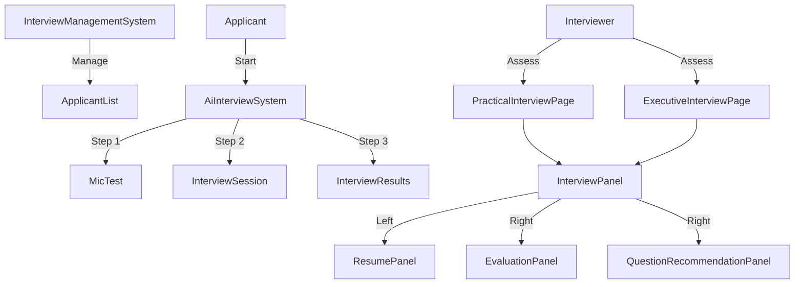

# 🛑 Interview System Status & Todo List (INTERVIEW_DEV_README)

이 문서는 **면접 시스템(AI 면접, 실무 면접, 임원 면접)**의 현재 상태, 발견된 문제점, 그리고 해결해야 할 과제들을 정리한 기술 문서입니다.  
**주의:** 현재 코드는 여러 브랜치가 병합되면서 연결이 끊기거나 충돌 후 정리되지 않은 부분이 많습니다.

---

## 📂 Frontend Interview Directory Analysis
아래는 `frontend/src/pages/interview` 및 `frontend/src/components/interview` 디렉토리의 주요 파일 분석입니다. Gemini(웹)에 붙여넣어 구조 파악에 활용하세요.

### 1. Pages (`frontend/src/pages/interview/`)
| 파일명 | 역할 | 설명 | 주요 이슈 |
| :--- | :--- | :--- | :--- |
| **`AiInterviewSystem.jsx`** | **AI 면접 메인** | AI 면접의 전체 흐름(안내 -> 마이크 테스트 -> 면접 진행 -> 결과)을 제어하는 최상위 컴포넌트. | WebSocket 연결, 비디오 녹화 로직 포함. 복잡도가 매우 높음. |
| **`PracticalInterviewPage.jsx`** | **실무진 면접** | 실무진 면접관이 사용하는 페이지. `InterviewPanel`을 `practical` 모드로 래핑함. | 디자인이 `InterviewPanel`에 강하게 의존. |
| **`ExecutiveInterviewPage.jsx`** | **임원진 면접** | 임원진 면접관이 사용하는 페이지. `InterviewPanel`을 `executive` 모드로 래핑함. | 실무진 면접과 구조가 거의 동일하여 중복 코드 발생. |
| **`InterviewManagementSystem.jsx`** | **관리자 대시보드** | 채용 담당자가 전체 지원자의 면접 진행 상황(AI/실무/임원)을 모니터링하고 관리하는 페이지. | 파일 크기가 매우 큼(1600줄+). 컴포넌트 분리 필요. |
| `ApplicantAiInterviewDashboard.jsx` | 지원자 대시보드 | `AiInterviewSystem`을 래핑하는 간단한 컴포넌트. | 불필요한 래퍼일 가능성 있음. |
| `InterviewResults.jsx` | AI 면접 결과 | AI 면접 완료 후 결과를 보여주는 페이지. | 데이터 로딩 및 그래프 시각화 로직 포함. |

### 2. Components (`frontend/src/components/interview/`)
| 파일명 | 역할 | 설명 |
| :--- | :--- | :--- |
| **`InterviewPanel.jsx`** | **공통 면접 패널** | 실무/임원 면접에서 공통으로 사용하는 화면. 좌측: 지원자 정보/영상, 우측: 평가표/질문지. |
| **`QuestionRecommendationPanel.jsx`** | **질문/분석 패널** | 질문 리스트 추천, 커스텀 질문 관리 및 실시간 STT/AI 분석 결과를 시각화하여 보여주는 패널. |
| `AiInterviewResultDisplay.jsx` | AI 결과 시각화 | 차트(Radar Chart 등)를 사용하여 AI 분석 결과를 시각화. |
| `InterviewerEvaluationPanel.jsx` | 평가 입력 폼 | 면접관이 점수를 입력하고 메모를 남기는 컴포넌트. |
| `CommonInterviewQuestionsPanel.jsx` | 공통 질문 리스트 | 직무별 공통 질문을 보여주고 선택하는 패널. |

### 3. Page Structure Overview (for Gemini)

---

## ✨ Recent Updates (최신 반영 사항)

### 🎨 UI/UX & Feature Improvements (QuestionRecommendationPanel.jsx)
면접관의 경험을 향상시키기 위해 **질문 추천 및 실시간 분석 패널**을 대폭 개선했습니다.

#### 1. Audio Visualizer (🔊)
*   **기능:** 녹음 중일 때만 활성화되는 실시간 오디오 파형 애니메이션.
*   **효과:** 면접관에게 "제대로 녹음/분석되고 있음"을 시각적으로 전달하여 심리적 안정감 제공.

#### 2. Timeline Card UI (💬)
*   **기능:** 기존의 단순 텍스트 로그를 **채팅형 타임라인 카드**로 변경.
*   **구조:** 
    *   **좌측/상단:** 질문(Q) 내용 및 시간.
    *   **우측/하단:** 답변(A) 내용이 담긴 강조된 말풍선 카드.
*   **키워드 하이라이팅:** 답변 텍스트 중 직무 핵심 키워드(React, Spring 등)를 **Bold & Blue** 처리하여 가독성 강화.

#### 3. AI Smart Badge & Accordion (🤖)
*   **기능:** 복잡한 분석 데이터를 간소화하여 직관적으로 표시.
*   **배지(Badge):** 답변 카드 헤더에 **감정 상태(긍정/불안 등)**와 **답변 적합도 점수**를 요약 배지로 표시.
*   **아코디언(Accordion):** 카드를 클릭하면 상세 분석 영역(음성 떨림 그래프, 상세 감정 분포, AI 피드백)이 펼쳐짐.

#### 4. Question Pinning & Custom Entry (📌 & ➕)
*   **기능:** 
    *   **고정(Pinning):** 추천 질문 리스트에서 원하는 질문을 선택하여 별도 탭에 고정.
    *   **직접 입력(Custom):** 면접관이 즉석에서 생각난 질문을 직접 입력하여 리스트에 추가.
*   **효과:** 면접관은 미리 선별해둔 질문 리스트(`선택/추가` 탭)만 보며 집중력 있게 면접 진행 가능.

---

## 🚨 Critical Issues (긴급 수정 필요)

### 1. `video-analysis` 서비스 누락
*   **현상:** `docker-compose.yml`에 `video-analysis` 서비스가 정의되어 있지 않음.
*   **영향:** 면접 영상 분석(표정, 시선, 화자 분리) 기능이 작동하지 않음. Frontend나 Backend에서 `http://localhost:8002`로 요청을 보내면 실패함.
*   **해결:** `docker-compose.yml`에 해당 서비스 컨테이너 추가 필요.

### 2. Frontend <-> Backend API 연결 불일치
*   **현상:** Frontend의 `api/aiInterviewApi.js` 및 `api/interviewEvaluationApi.js`가 호출하는 엔드포인트와 Backend의 `api/v1/` 엔드포인트가 일치하지 않는 경우가 다수 존재.
*   **확인 필요:**
    *   `AiInterviewSystem.jsx`에서 WebSocket 연결 주소가 올바른지 확인.
    *   Backend의 `realtime_interview.py`가 실제로 구현되어 있는지 확인 (현재 파일 존재하나 로직 비어있을 가능성 높음).

### 3. 면접 단계(AI -> 실무 -> 임원) 데이터 흐름 단절
*   **현상:** AI 면접 결과(`interview_result`)가 실무 면접(`practical`) 단계로 넘어갈 때, 데이터가 연동되지 않고 독립적으로 돔.
*   **해결:** DB 스키마에서 `application_id`를 기준으로 각 면접 단계의 점수와 평가가 누적되도록 로직 수정 필요.

---

## 🛠️ Refactoring Checklist (향후 작업 목록)

### 1. Backend & API (Integration)
- [ ] **질문 관리 API:** Frontend에서 고정(`pin`)하거나 추가(`custom`)한 질문 리스트를 DB(`interview_question_log` 또는 별도 테이블)에 저장하고 불러오는 API 구현.
- [ ] **Video Analysis 통합:** `video-analysis` 서비스를 Docker 네트워크에 편입시키고, Backend에서 Proxy 형태로 호출하거나 Frontend에서 직접 호출하도록 CORS 설정.
- [ ] **WebSocket 안정화:** 실시간 면접 STT 및 피드백을 위한 WebSocket 연결(`ws://...`)이 끊기지 않도록 재연결 로직 추가.
- [ ] **데이터 모델 정규화:** `interview_question_log`, `interview_evaluation` 테이블 간의 관계가 명확하지 않음. (질문별 점수 vs 전체 면접 점수).

### 2. Frontend Components
- [ ] **페이지 구조 정리:** `pages/interview/` 내부에 중복된 파일이 많음 (예: `InterviewProgressPractical.jsx` vs `PracticalInterviewPage.jsx`). 하나로 통합 필요.
- [ ] **UI 표준화:** 실무 면접과 임원 면접 페이지의 UI가 서로 다른 디자인 시스템을 쓰고 있음. 통일 필요.
- [ ] **API 호출 모듈화:** 컴포넌트 내부에서 `axios`를 직접 호출하는 코드를 `api/` 폴더로 이동.

### 3. AI Agent (Real-time Analysis)
- [ ] **실시간 키워드 추출:** STT 텍스트에서 직무 연관 키워드를 추출하여 Frontend로 전송 (하이라이팅 기능 연동).
- [ ] **답변 적합도 평가:** 질문 의도와 답변의 일치도를 분석하여 점수(0~100) 및 배지(Badge) 데이터 생성.
- [ ] **꼬리 질문 생성:** 답변 내용에 따라 심층 질문을 실시간으로 생성하여 추천해주는 API 구현.
- [ ] **면접관 페르소나:** 실무 면접관(기술 중심) vs 임원 면접관(인성/비전 중심)의 프롬프트가 하드코딩 되어 있는지 확인하고, DB 기반 설정으로 변경.

---

## ⚠️ Known Legacy Code (주의)
*   `interview_41_47_50_azure_final.mp3` 등 하드코딩된 테스트 파일이 코드 내에 존재할 수 있음.
*   `video-analysis` 폴더 내의 `requirements.txt`는 TensorFlow 버전을 강제하므로, 다른 서비스와 충돌 나지 않도록 반드시 **독립된 컨테이너**에서 실행해야 함.
