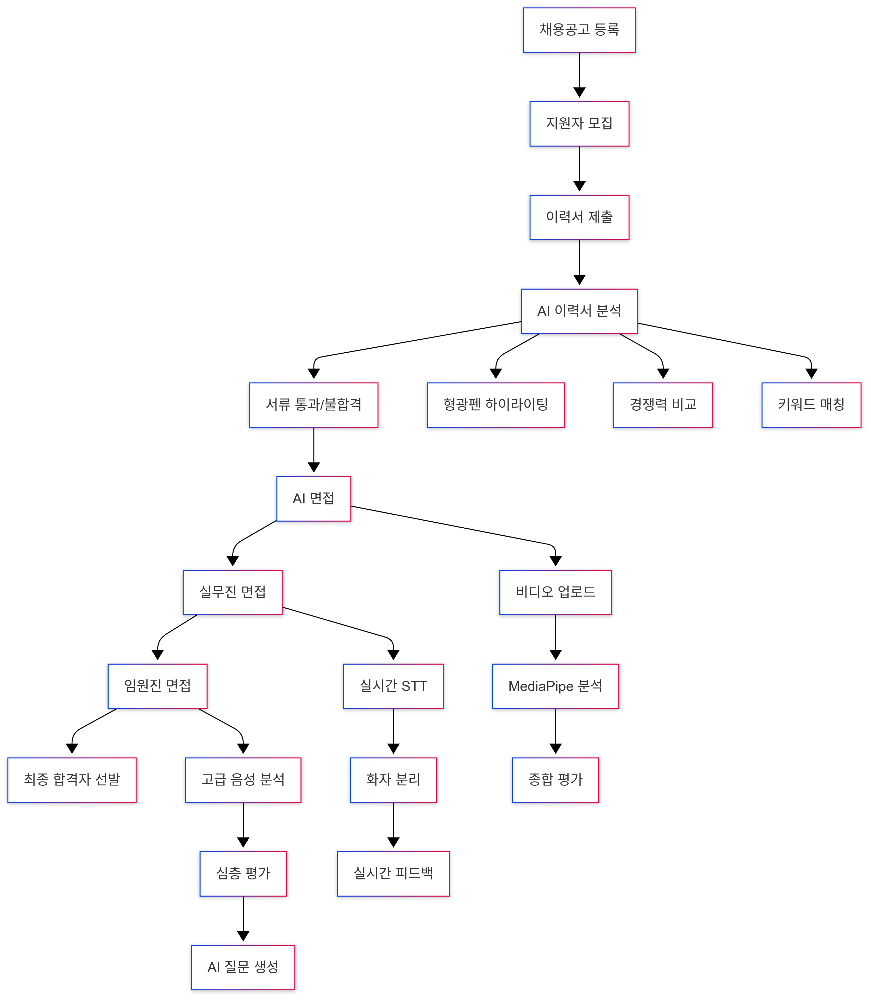
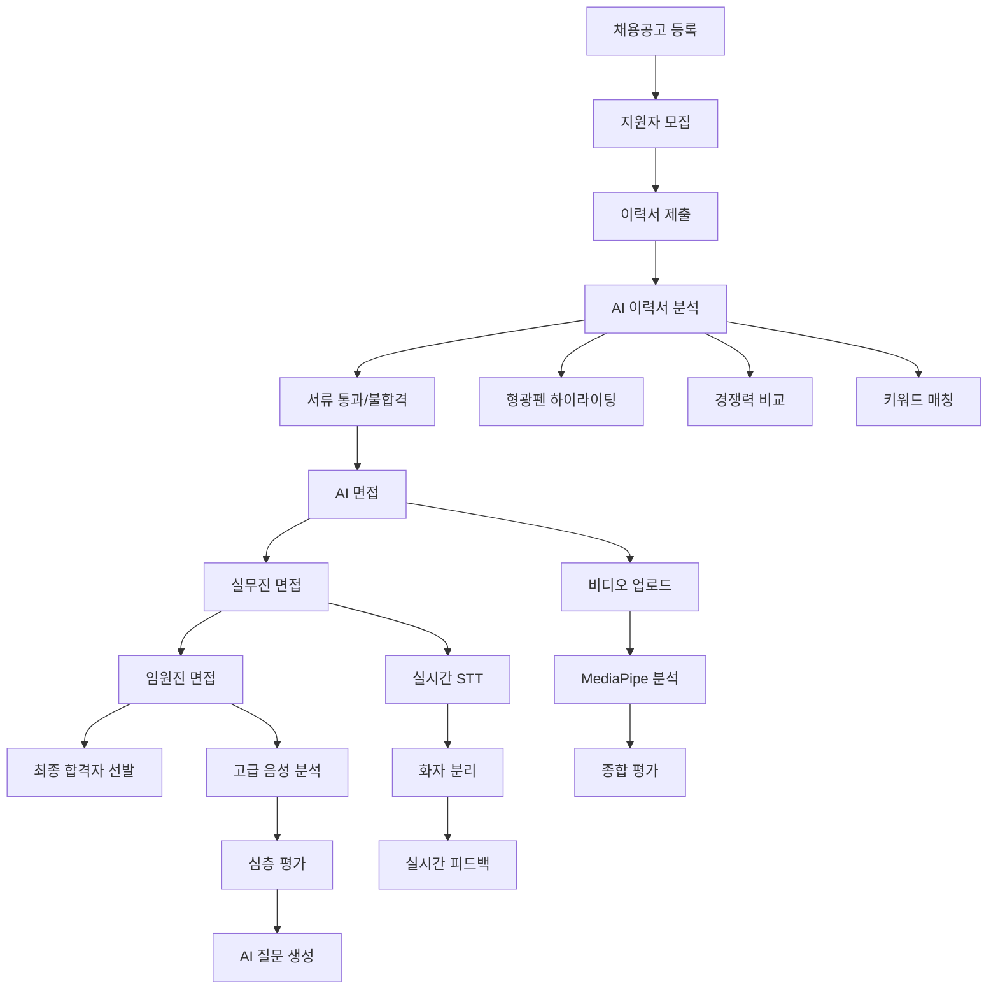
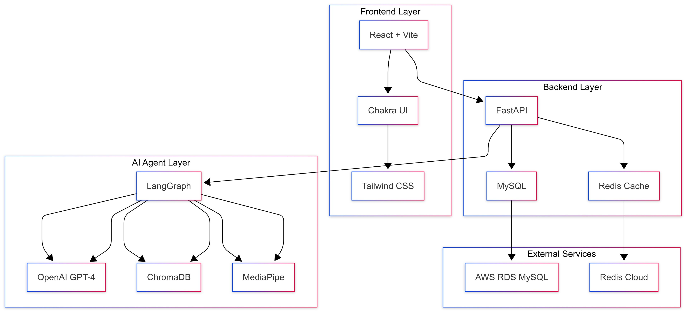
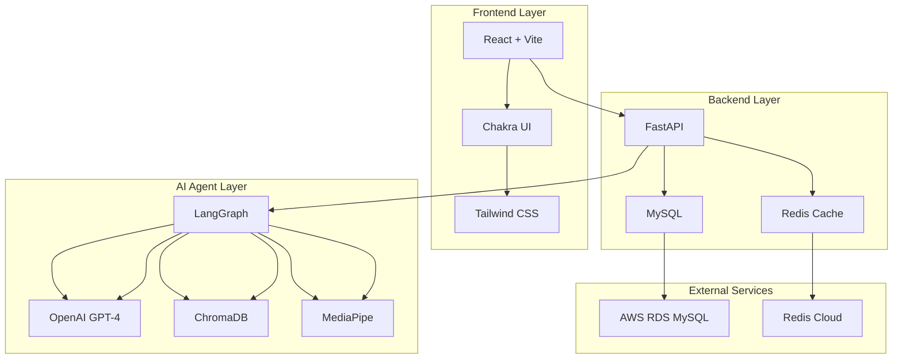

# Kocruit - AI 기반 채용 관리 플랫폼

> **"채용의 모든 과정을 AI로 혁신하다"**

기존 채용 프로세스의 비효율성을 해결하기 위해 개발한 AI 기반 채용 관리 플랫폼입니다. 채용공고 등록부터 최종 합격자 선발까지, 채용 담당자의 업무를 대폭 간소화합니다.

## 🎯 왜 만들었나요?

채용 과정에서 겪는 문제점들을 해결하고 싶었습니다:
- **이력서 검토 시간**: 수백 장의 이력서를 일일이 검토하는 번거로움
- **면접의 주관성**: 면접관마다 다른 평가 기준과 편견
- **비효율적인 프로세스**: 반복적인 업무로 인한 시간 낭비

## 🚀 전체 채용 프로세스



<details>
<summary>📊 Mermaid 코드 보기 (클릭해서 보기)</summary>



</details>

## ✨ 주요 기능

### 📝 채용공고 관리
- **공고 등록**: 직무별 상세 공고 작성
- **지원자 관리**: 실시간 지원 현황 모니터링
- **자동 면접관 배정**: AI가 최적의 면접관 선택

### 🤖 AI 이력서 분석
- **형광펜 하이라이팅**: AI가 핵심 내용을 색상별로 구분
- **경쟁력 비교**: 동일 직무 지원자들과의 상대적 평가
- **키워드 매칭**: 채용공고 요구사항과의 적합도 분석
- **표절 검사**: 이력서 중복도 자동 검사

### 🎤 3단계 면접 시스템
- **AI 면접**: 비디오 업로드 → MediaPipe 분석 → 종합 평가
- **실무진 면접**: 실시간 음성인식 → 화자 분리 → 즉시 피드백
- **임원진 면접**: 고급 분석 → 심층 평가 → AI 질문 생성

### 📊 데이터 기반 인사이트
- **면접 패턴 분석**: 채용 트렌드 파악
- **성장 예측**: 지원자 잠재력 평가
- **통계 리포트**: 채용 현황 시각화

## 🛠️ 기술 스택

**Frontend**: React 18, Vite, Tailwind CSS, Chakra UI  
**Backend**: FastAPI, MySQL, Redis  
**AI/ML**: LangGraph, OpenAI GPT-4, ChromaDB, MediaPipe  
**DevOps**: Docker, Docker Compose

## 🏗️ 시스템 아키텍처



<details>
<summary>🏗️ Mermaid 코드 보기 (클릭해서 보기)</summary>



</details>

## 🚀 핵심 기술

### LangGraph를 활용한 AI 워크플로우
복잡한 채용 프로세스를 LangGraph로 체계화했습니다. 이력서 분석부터 면접 평가까지 각 단계별로 AI 에이전트가 자동으로 처리합니다.

### 실시간 음성인식 시스템
WebSocket을 활용한 실시간 음성인식으로 면접 중 즉시 피드백을 제공합니다. 화자 분리 기술로 면접관과 지원자를 자동으로 구분합니다.

### MediaPipe 기반 비디오 분석
AI 면접에서 업로드된 비디오를 MediaPipe로 분석하여 표정, 자세, 음성 톤 등을 종합적으로 평가합니다.

## 🚀 실행 방법

```bash
# 1. 프로젝트 클론
git clone https://github.com/your-username/KOSA-FINAL-PROJECT-02.git
cd KOSA-FINAL-PROJECT-02

# 2. 환경 변수 설정
echo "OPENAI_API_KEY=your_key_here" > .env

# 3. Docker로 실행
docker-compose up --build -d

# 4. 접속
# Frontend: http://localhost:5173
# Backend: http://localhost:8000
# AI Agent: http://localhost:8001
```

## 💡 개발 과정에서 배운 점

### LangGraph의 위력
처음에는 단순한 API 호출로 AI 기능을 구현했는데, LangGraph를 도입하면서 복잡한 워크플로우를 체계적으로 관리할 수 있게 되었습니다. 특히 면접 평가 같은 다단계 프로세스에서 큰 효과를 봤습니다.

### 실시간 음성인식의 도전
WebSocket을 활용한 실시간 음성인식 구현이 가장 어려웠습니다. 음성 데이터의 청크 처리, 화자 분리, 실시간 피드백 등 여러 기술을 조합해야 했죠.

### MediaPipe의 활용
AI 면접에서 비디오 분석을 위해 MediaPipe를 도입했습니다. 표정, 자세, 손동작 등을 실시간으로 분석하는 과정에서 컴퓨터 비전의 매력을 느꼈습니다.

## 📈 성과

- **개발 기간**: 6주
- **코드 라인**: 15,000+ 라인
- **API 엔드포인트**: 50+ 개
- **AI 에이전트**: 20+ 개 도구

## 🔗 관련 링크

- [면접 시스템 상세 설명](./docs/interview-system.md)
- [API 문서](http://localhost:8000/docs)
- [프로젝트 위키](https://github.com/your-username/KOSA-FINAL-PROJECT-02/wiki)

