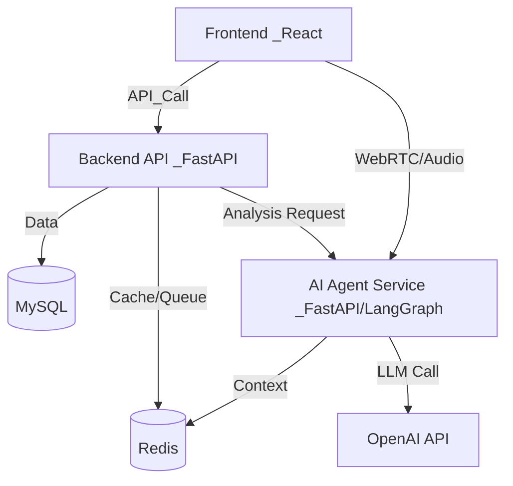

# 📘 Kocruit 개발자 가이드 (README_DEV)

이 문서는 **Kocruit 프로젝트**의 구조, 핵심 로직, 그리고 개발 환경을 개발자가 빠르게 파악할 수 있도록 정리한 가이드입니다.

---

## 1. 프로젝트 개요
**Kocruit**은 AI 기반 채용 보조 솔루션입니다. 지원자의 이력서를 분석하고, 맞춤형 면접 질문을 생성하며, 실제 면접(또는 모의 면접)을 실시간으로 분석하여 채용 담당자에게 인사이트를 제공합니다.

### 🌟 핵심 기능
*   **이력서 분석 및 하이라이팅:** 이력서 내 핵심 키워드 추출 및 시각화.
*   **AI 서류 평가:** 채용 공고와 이력서를 비교하여 적합도 점수 산출.
*   **면접 질문 생성:** 이력서 기반 개인화된 면접 질문 자동 생성.
*   **AI 면접 및 실시간 분석:** 음성 인식(STT)을 통한 면접 답변 분석 및 감정/태도 평가.
*   **채용 챗봇:** RAG(검색 증강 생성) 기반 채용 관련 질의응답.

---

## 2. 시스템 아키텍처

이 프로젝트는 **MSA(Microservices Architecture) 지향**의 Docker 컨테이너 환경에서 동작합니다.



### 🏗️ 컨테이너 구성
| 서비스명 | 포트 | 역할 | 기술 스택 |
| :--- | :--- | :--- | :--- |
| **backend** | `8000` | 메인 비즈니스 로직, DB 관리, 사용자 인증 | FastAPI, SQLAlchemy |
| **agent** | `8001` | AI 워크플로우 실행, LLM 연동, 챗봇 | FastAPI, LangGraph, LangChain |
| **frontend** | `5173` | 사용자 인터페이스 | React, Vite, Tailwind |
| **redis** | `6379` | 세션 관리, 캐싱, 작업 큐 | Redis 7.2 |
| **db** | `3306` | 주 데이터 저장소 (AWS RDS 연결 또는 로컬) | MySQL |

---

## 3. 폴더 구조 (Directory Structure)

```bash
KOSA-FINAL-PROJECT-02/
├── agent/                  # 🧠 AI Agent 서비스 (FastAPI + LangGraph)
│   ├── agents/             # 워크플로우 정의
│   ├── tools/              # 개별 AI 도구
│   └── main.py             # Agent 서비스 진입점
├── backend/                # ⚙️ 메인 백엔드 서비스
│   ├── app/
│   │   ├── api/v2/         # v2 API 엔드포인트 (도메인 주도 설계)
│   │   ├── models/v2/      # v2 SQLAlchemy DB 모델
│   │   ├── services/v2/    # v2 비즈니스 로직
│   │   ├── schemas/        # Pydantic 데이터 스키마
│   │   └── utils/          # agent_client.py 등 유틸리티
│   └── main.py             # Backend 서비스 진입점
├── frontend/               # 🎨 프론트엔드 (React)
│   ├── src/
│   │   ├── components/     # UI 컴포넌트
│   │   └── ...
├── initdb/                 # 🗄️ DB 초기화 및 마이그레이션 (migration_v2.sql)
└── docker-compose.yml      # 🐳 전체 시스템 오케스트레이션
```

## 4. 데이터베이스 변경 사항 (v2)

### 🔄 지원자 상태 관리 정규화 (Normalization)
기존의 `Application` 테이블에 모든 전형 단계의 상태가 컬럼으로 존재하던 방식에서, **`ApplicationStage` 테이블을 분리**하여 관리하는 방식으로 변경되었습니다.

*   **Application**: 지원자 기본 정보, 최종 상태(`overall_status`), 현재 단계(`current_stage`) 관리.
*   **ApplicationStage**: 각 전형 단계(`DOCUMENT`, `AI_INTERVIEW` 등)별 상태, 점수, 탈락 사유 관리.
*   **호환성**: 기존 코드를 위해 `Application` 모델에 `@property`를 두어 기존 필드명(`document_status` 등)으로도 접근 가능하도록 처리함.

---

## 5. 핵심 로직 상세 분석

### 1 백엔드 (Backend)
*   **역할:** 클라이언트 요청 처리, 데이터 CRUD, AI 서비스로의 작업 위임.
*   **주요 서비스 (`backend/app/services/`):**
    *   `application_evaluation_service.py`: 지원서를 접수받고 1차적인 처리를 담당.
    *   `ai_interview_evaluation_service.py`: 면접 결과를 저장하고 통계 처리.
    *   `scheduler/`: 주기적으로 상태를 체크하거나, 시간이 오래 걸리는 AI 분석 요청을 관리.

### 2 AI 에이전트 (Agent)
*   **역할:** 복잡한 추론이 필요한 작업을 수행하는 독립 서비스.
*   **LangGraph 활용:**
    *   단순 LLM 호출이 아닌, **상태(State)**를 가진 워크플로우로 구성됨.
    *   예: `chatbot_graph.py`는 사용자의 의도를 파악 -> 도구 선택 -> 실행 -> 응답 생성의 흐름을 가짐.
*   **주요 엔드포인트 (`agent/main.py`):**
    *   `/highlight-resume`: 이력서 텍스트를 받아 중요 부분을 마킹.
    *   `/evaluate-application`: 채용 공고와 이력서를 매칭하여 점수화.
    *   `/agent/speech-recognition`: 오디오 파일을 텍스트로 변환(STT) 및 분석.

### 3 데이터 흐름 예시 (서류 평가)
1.  **Frontend:** 사용자가 이력서 업로드.
2.  **Backend:** 이력서 파일 저장, DB에 지원자 정보 등록.
3.  **Backend:** `Agent` 서비스의 `/evaluate-application` 엔드포인트 호출 (비동기 또는 동기).
4.  **Agent:**
    *   LLM을 통해 이력서 텍스트 추출.
    *   채용 공고의 자격 요건과 이력서 매칭 분석.
    *   점수 및 합불 사유 생성.
5.  **Backend:** 결과를 받아 DB 업데이트 및 알림 발송.

---

## 5. 개발 환경 설정

이 프로젝트는 `docker-compose`를 기반으로 설정되어 있습니다.

### 사전 요구사항
*   Docker Desktop 설치
*   `.env` 파일 설정 (Backend, Agent, Frontend 각각의 환경변수 확인)

### 실행 방법
```bash
# 전체 서비스 실행 (Background)
docker-compose up -d

# 로그 확인 (Follow 모드)
docker-compose logs -f
```

### 주요 환경 변수 (참고용)
*   `OPENAI_API_KEY`: AI 기능을 위해 필수.
*   `DB_HOST`, `DB_USER`, `DB_PASSWORD`: MySQL 연결 정보.
*   `REDIS_HOST`: Redis 연결 정보.

---

## 6. 참고 사항 (Memo)
*   **DB 마이그레이션:** `initdb/` 폴더 내의 스크립트를 참조하거나, FastAPI 시작 시 `Base.metadata.create_all`이 실행되어 테이블을 생성합니다.
*   **API 문서:** 서버 실행 후 아래 주소에서 Swagger UI 확인 가능.
    *   Backend: `http://localhost:8000/docs`
    *   Agent: `http://localhost:8001/docs`

