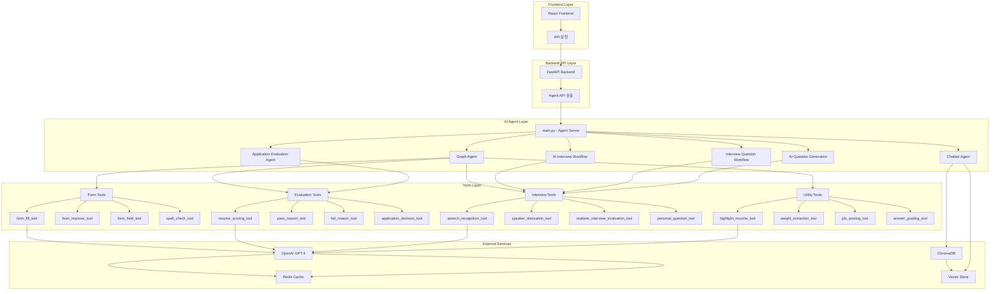
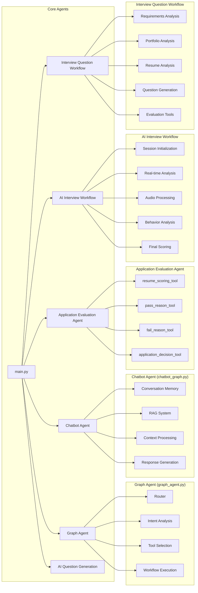
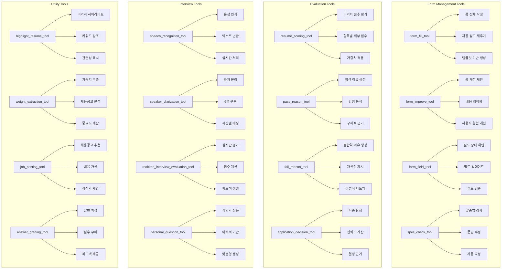
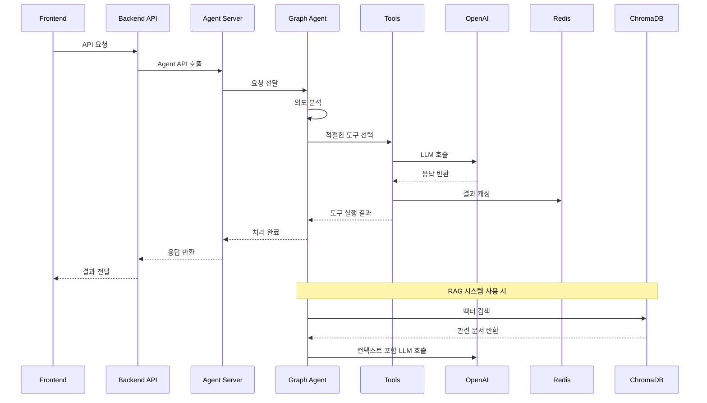
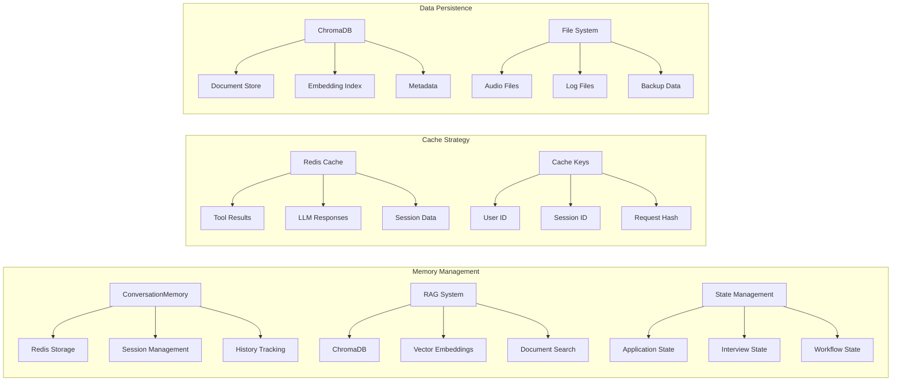
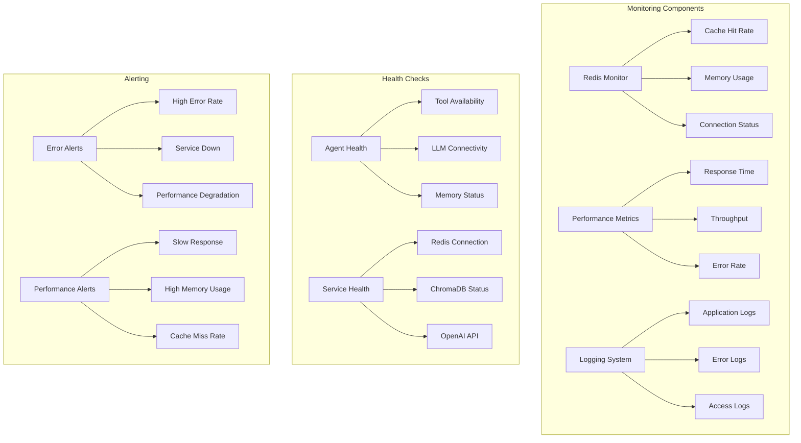
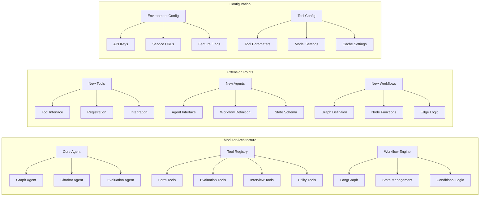
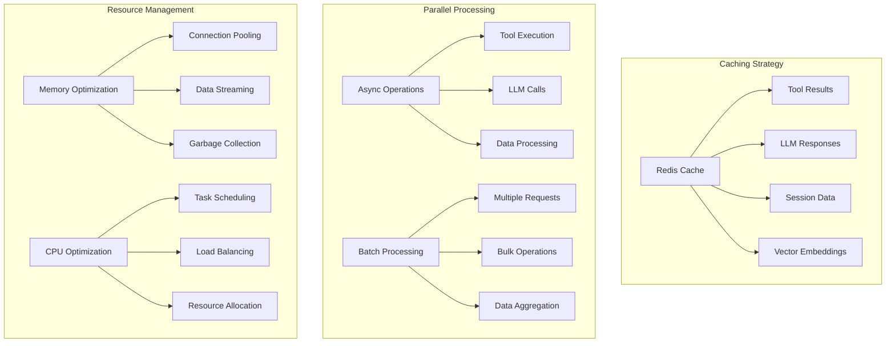

# AI Agent 시스템 도식화

## 🏗️ AI Agent 시스템 전체 아키텍처

## 🤖 주요 에이전트 구조 및 역할

## 🔄 LangGraph 워크플로우 구조

```mermaid
flowchart TD
    subgraph "Graph Agent Workflow"
        A[User Input] --> B[Router]
        B --> C{Intent Analysis}
        C -->|Form Fill| D[form_fill_tool]
        C -->|Form Improve| E[form_improve_tool]
        C -->|Spell Check| F[spell_check_tool]
        C -->|Job Posting| G[job_posting_tool]
        C -->|Interview Questions| H[interview_question_tool]
        C -->|Info Request| I[info_tool]
        
        D --> J[Response]
        E --> J
        F --> J
        G --> J
        H --> J
        I --> J
    end
    
    subgraph "Application Evaluation Workflow"
        K[Application Data] --> L[resume_scoring_tool]
        L --> M[pass_reason_tool]
        M --> N[fail_reason_tool]
        N --> O[application_decision_tool]
        O --> P[Final Decision]
    end
    
    subgraph "AI Interview Workflow"
        Q[Interview Session] --> R[initialize_session]
        R --> S[generate_scenario_questions]
        S --> T[start_real_time_analysis]
        T --> U[process_audio_analysis]
        U --> V[process_behavior_analysis]
        V --> W[calculate_final_score]
    end
    
    subgraph "Interview Question Generation"
        X[Resume & Job Info] --> Y[analyze_requirements]
        Y --> Z[portfolio_analyzer]
        Z --> AA[resume_analyzer]
        AA --> BB[question_generator]
        BB --> CC[evaluation_tools]
    end
```

## 🛠️ 도구(Tools) 시스템 구조

## 🔗 데이터 흐름 및 통신 구조

## 🧠 메모리 및 상태 관리 시스템

## 📊 시스템 모니터링 및 로깅

## 🔧 확장성 및 모듈화 구조

## 📈 성능 최적화 전략

이 도식화를 통해 AI Agent 시스템의 전체적인 구조와 각 컴포넌트의 역할, 데이터 흐름, 그리고 확장성을 명확하게 파악할 수 있습니다. 특히 LangGraph를 활용한 워크플로우 기반의 모듈화된 아키텍처가 어떻게 구성되어 있는지 시각적으로 표현했습니다. 