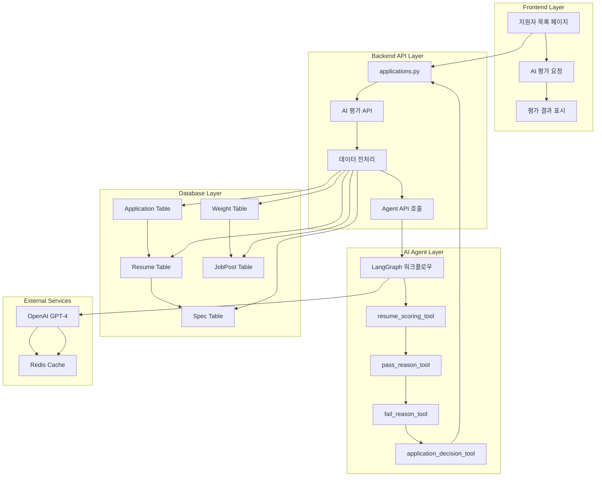
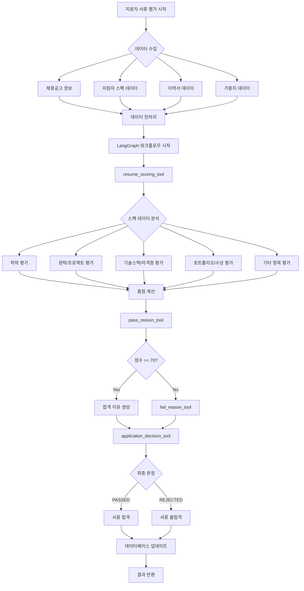
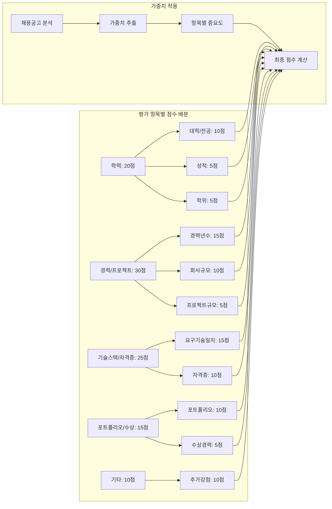
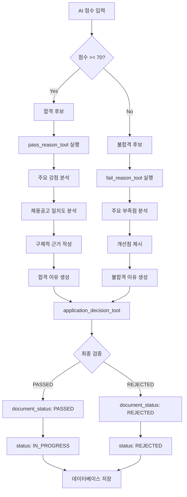
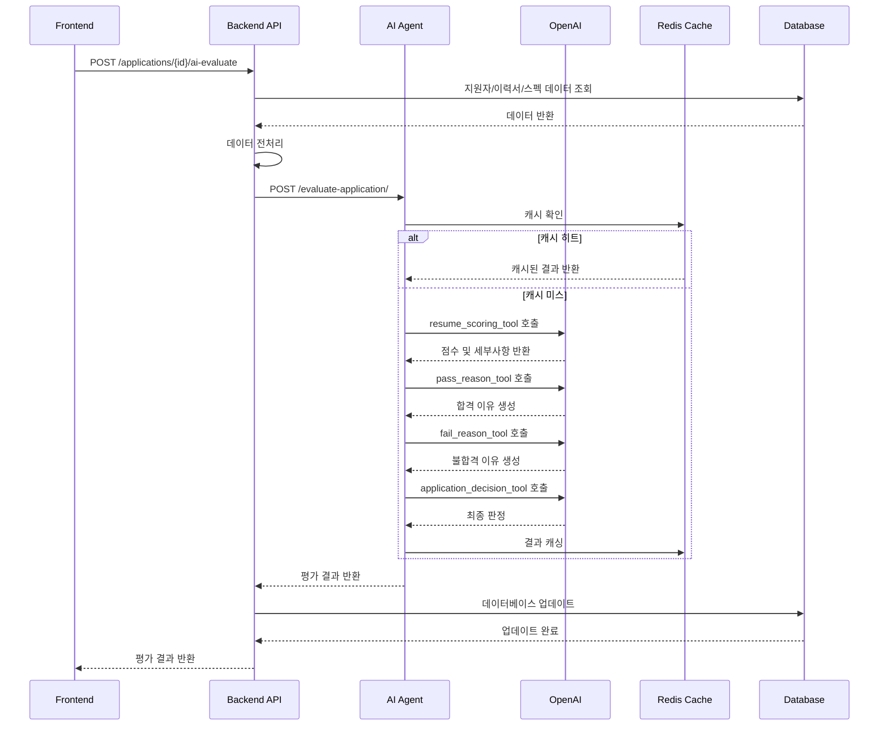

# 서류합격자 선발 AI 시스템 도식화

## 🏗️ 전체 시스템 아키텍처



## 🔄 AI 평가 워크플로우 상세 플로우차트



## 📊 평가 기준 및 점수 산정 프로세스



## 🎯 합격/불합격 판정 로직



## 🔗 데이터 흐름 및 API 연동 구조



## 🛠️ 기술적 구현 세부사항

### LangGraph 워크플로우 구조
```python
# 워크플로우 노드 구성
workflow = StateGraph(ApplicationState)

# 노드 추가
workflow.add_node("score_resume", resume_scoring_tool)
workflow.add_node("generate_pass_reason", pass_reason_tool)
workflow.add_node("generate_fail_reason", fail_reason_tool)
workflow.add_node("make_decision", application_decision_tool)

# 엣지 연결
workflow.set_entry_point("score_resume")
workflow.add_edge("score_resume", "generate_pass_reason")
workflow.add_edge("generate_pass_reason", "generate_fail_reason")
workflow.add_edge("generate_fail_reason", "make_decision")
workflow.add_edge("make_decision", END)
```

### 평가 기준 상세
| 항목 | 배점 | 세부 평가 내용 |
|------|------|----------------|
| 학력 | 20점 | 대학/전공(10점), 성적(5점), 학위(5점) |
| 경력/프로젝트 | 30점 | 경력년수(15점), 회사규모(10점), 프로젝트규모(5점) |
| 기술스택/자격증 | 25점 | 요구기술일치(15점), 자격증(10점) |
| 포트폴리오/수상 | 15점 | 포트폴리오(10점), 수상경력(5점) |
| 기타 | 10점 | 추가강점(10점) |

### 합격 기준
- **합격 기준**: 70점 이상
- **불합격 기준**: 70점 미만
- **자동 판정**: AI 점수 기반 자동 합격/불합격 결정

### 캐싱 전략
- **Redis 캐싱**: 동일한 입력에 대한 중복 평가 방지
- **캐시 키**: 지원자 ID + 채용공고 ID + 평가 타임스탬프
- **TTL**: 24시간 (평가 결과의 일관성 보장)

## 📈 시스템 성능 및 확장성

### 성능 최적화
1. **Redis 캐싱**: 중복 평가 방지로 응답 시간 단축
2. **배치 처리**: 다수 지원자 동시 평가 지원
3. **비동기 처리**: 대용량 데이터 처리 시 비동기 워크플로우

### 확장성 고려사항
1. **모듈화된 도구**: 새로운 평가 기준 추가 용이
2. **가중치 시스템**: 채용공고별 맞춤 평가 가능
3. **LangGraph 워크플로우**: 복잡한 평가 로직 확장 가능

### 모니터링 및 로깅
- 각 도구별 실행 시간 측정
- 평가 정확도 추적
- 에러율 및 복구율 모니터링
- 사용자 피드백 기반 시스템 개선 