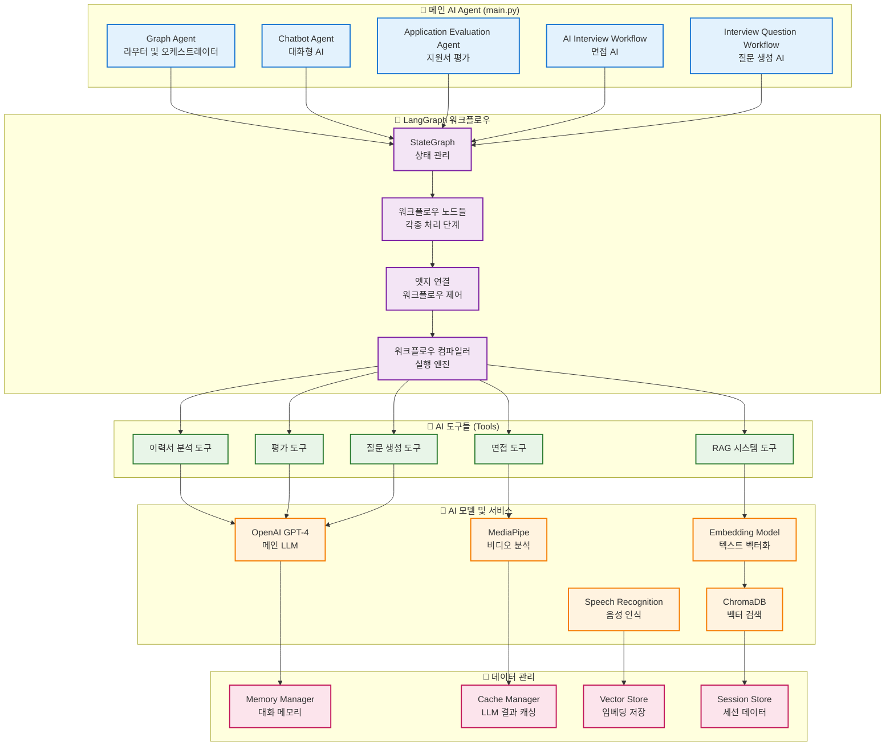
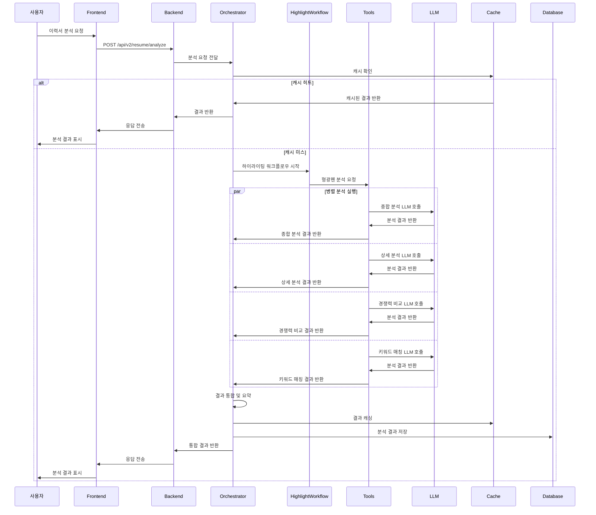
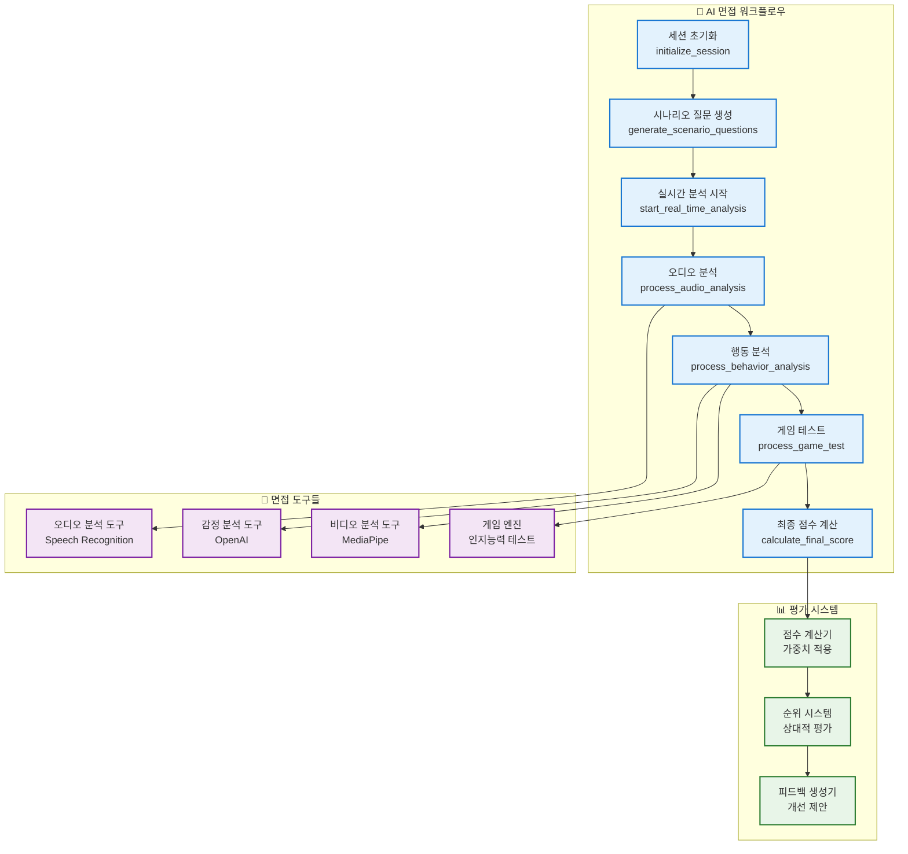
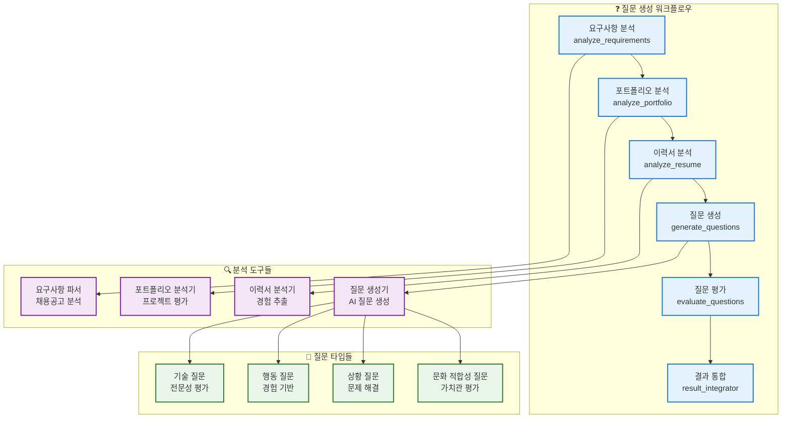
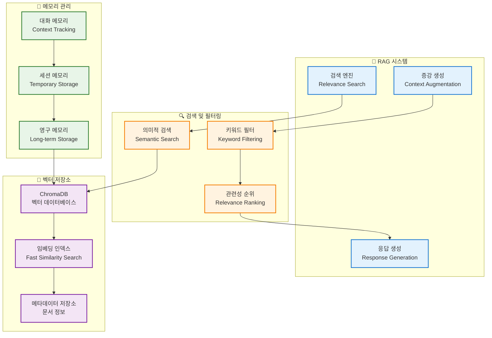
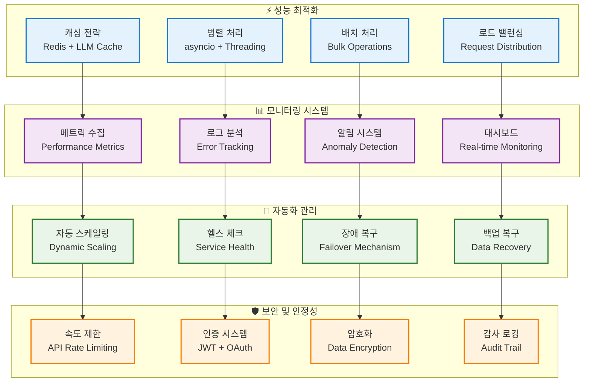

# 🤖 AI Agent 워크플로우 상세 아키텍처

## LangGraph 기반 AI Agent 시스템 전체 구조

## 이력서 분석 AI Agent 워크플로우

## 면접 AI Agent 워크플로우

## 질문 생성 AI Agent 워크플로우

## RAG 시스템 및 메모리 관리

## AI Agent 성능 최적화 및 모니터링

## AI Agent 확장성 및 마이크로서비스 아키텍처

### 🏗️ 마이크로서비스 분리 전략
- **이력서 분석 서비스**: 독립적인 이력서 분석 전용 서비스
- **면접 AI 서비스**: 면접 관련 AI 처리 전용 서비스
- **질문 생성 서비스**: 면접 질문 생성 전용 서비스
- **평가 서비스**: 지원자 평가 및 점수 계산 전용 서비스

### 🔄 서비스 간 통신
- **RESTful API**: 동기 통신을 위한 REST API
- **Message Queue**: 비동기 통신을 위한 RabbitMQ/Kafka
- **gRPC**: 고성능 서비스 간 통신
- **GraphQL**: 유연한 데이터 쿼리를 위한 GraphQL

### 📈 확장성 고려사항
- **수평 확장**: 다수의 AI Agent 인스턴스 운영
- **수직 확장**: 더 강력한 하드웨어 리소스 활용
- **지역별 배포**: 글로벌 사용자를 위한 지역별 서비스 배포
- **캐싱 계층**: 다층 캐싱으로 성능 최적화
