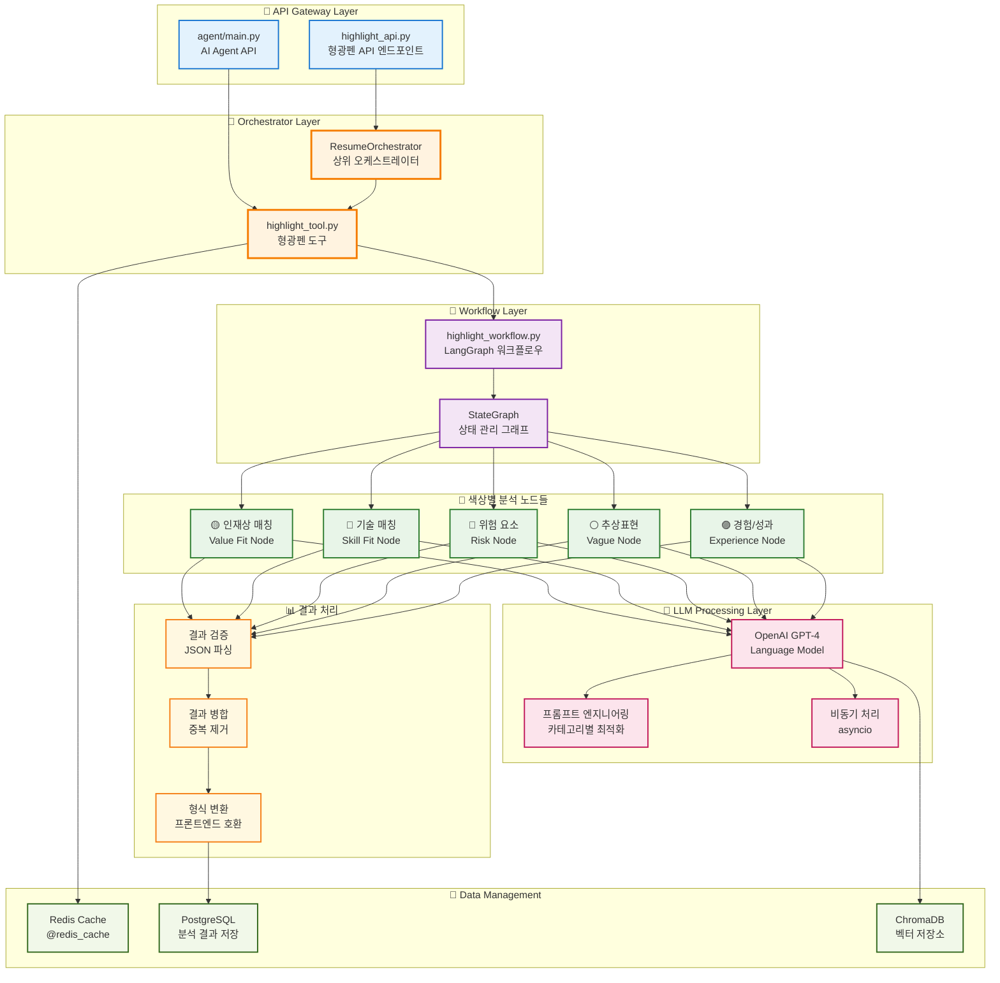
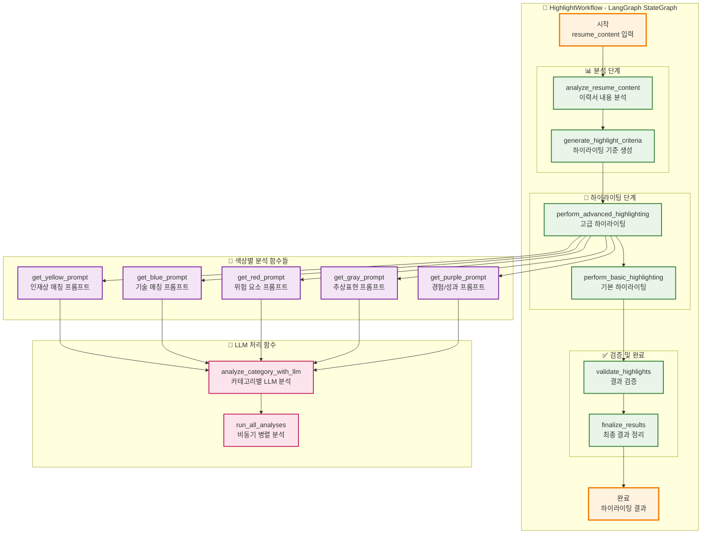
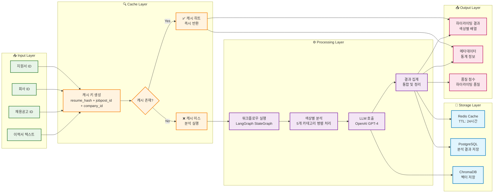
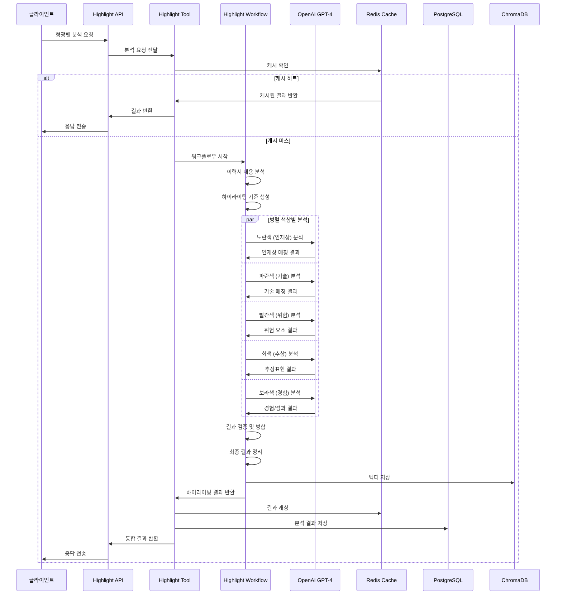

# 형광펜 AI Agent 아키텍처 다이어그램

## 🎨 형광펜 AI Agent 전체 아키텍처

## 🔄 HighlightWorkflow 상세 구조

## 🎨 색상별 분석 노드 상세 구조

```mermaid
graph TB
    subgraph "🟡 Yellow Node - 인재상 매칭 (Value Fit)"
        YELLOW_INPUT[이력서 텍스트<br/>회사 인재상 키워드]
        YELLOW_PROMPT[get_yellow_prompt<br/>인재상 매칭 프롬프트]
        YELLOW_LLM[LLM 분석<br/>인재상 가치 매칭]
        YELLOW_OUTPUT[노란색 하이라이트<br/>인재상 매칭 결과]
    end
    
    subgraph "🔵 Blue Node - 기술 매칭 (Skill Fit)"
        BLUE_INPUT[이력서 텍스트<br/>채용공고 기술 키워드]
        BLUE_PROMPT[get_blue_prompt<br/>기술 매칭 프롬프트]
        BLUE_LLM[LLM 분석<br/>기술 스택 매칭]
        BLUE_OUTPUT[파란색 하이라이트<br/>기술 매칭 결과]
    end
    
    subgraph "🔴 Red Node - 위험 요소 (Risk)"
        RED_INPUT[이력서 텍스트<br/>위험 키워드]
        RED_PROMPT[get_red_prompt<br/>위험 요소 프롬프트]
        RED_LLM[LLM 분석<br/>위험 요소 탐지]
        RED_OUTPUT[빨간색 하이라이트<br/>위험 요소 결과]
    end
    
    subgraph "⚪ Gray Node - 추상표현 (Vague)"
        GRAY_INPUT[이력서 텍스트<br/>추상 키워드]
        GRAY_PROMPT[get_gray_prompt<br/>추상표현 프롬프트]
        GRAY_LLM[LLM 분석<br/>추상표현 식별]
        GRAY_OUTPUT[회색 하이라이트<br/>추상표현 결과]
    end
    
    subgraph "🟣 Purple Node - 경험/성과 (Experience)"
        PURPLE_INPUT[이력서 텍스트<br/>경험 키워드]
        PURPLE_PROMPT[get_purple_prompt<br/>경험/성과 프롬프트]
        PURPLE_LLM[LLM 분석<br/>경험/성과 추출]
        PURPLE_OUTPUT[보라색 하이라이트<br/>경험/성과 결과]
    end
    
    %% 각 노드 내부 연결
    YELLOW_INPUT --> YELLOW_PROMPT
    YELLOW_PROMPT --> YELLOW_LLM
    YELLOW_LLM --> YELLOW_OUTPUT
    
    BLUE_INPUT --> BLUE_PROMPT
    BLUE_PROMPT --> BLUE_LLM
    BLUE_LLM --> BLUE_OUTPUT
    
    RED_INPUT --> RED_PROMPT
    RED_PROMPT --> RED_LLM
    RED_LLM --> RED_OUTPUT
    
    GRAY_INPUT --> GRAY_PROMPT
    GRAY_PROMPT --> GRAY_LLM
    GRAY_LLM --> GRAY_OUTPUT
    
    PURPLE_INPUT --> PURPLE_PROMPT
    PURPLE_PROMPT --> PURPLE_LLM
    PURPLE_LLM --> PURPLE_OUTPUT
    
    %% 스타일링
    classDef yellow fill:#fff9c4,stroke:#f57f17,stroke-width:2px
    classDef blue fill:#e3f2fd,stroke:#1976d2,stroke-width:2px
    classDef red fill:#ffebee,stroke:#d32f2f,stroke-width:2px
    classDef gray fill:#f5f5f5,stroke:#757575,stroke-width:2px
    classDef purple fill:#f3e5f5,stroke:#7b1fa2,stroke-width:2px
    
    class YELLOW_INPUT,YELLOW_PROMPT,YELLOW_LLM,YELLOW_OUTPUT yellow
    class BLUE_INPUT,BLUE_PROMPT,BLUE_LLM,BLUE_OUTPUT blue
    class RED_INPUT,RED_PROMPT,RED_LLM,RED_OUTPUT red
    class GRAY_INPUT,GRAY_PROMPT,GRAY_LLM,GRAY_OUTPUT gray
    class PURPLE_INPUT,PURPLE_PROMPT,PURPLE_LLM,PURPLE_OUTPUT purple
```

## 🤖 LLM 처리 및 프롬프트 엔지니어링

```mermaid
graph TB
    subgraph "🤖 LLM Engine"
        OPENAI_GPT4[OpenAI GPT-4<br/>gpt-4o-mini]
        TEMPERATURE[Temperature: 0.1<br/>일관성 있는 결과]
        MODEL_CONFIG[모델 설정<br/>최적화된 파라미터]
    end
    
    subgraph "📝 프롬프트 엔지니어링"
        PROMPT_TEMPLATES[프롬프트 템플릿<br/>카테고리별 최적화]
        
        subgraph "🎯 프롬프트 구조"
            ROLE_DEF[역할 정의<br/>전문가 역할 명시]
            CRITERIA[분석 기준<br/>구체적 매칭 기준]
            EXAMPLES[예시 제공<br/>실제 매칭 사례]
            OUTPUT_FORMAT[출력 형식<br/>JSON 구조 정의]
        end
    end
    
    subgraph "⚡ 비동기 처리"
        ASYNC_ENGINE[asyncio<br/>비동기 처리 엔진]
        PARALLEL_EXEC[병렬 실행<br/>5개 카테고리 동시 처리]
        CONCURRENCY[동시성 관리<br/>LLM 호출 최적화]
    end
    
    subgraph "🔍 분석 프로세스"
        TEXT_PREP[텍스트 전처리<br/>문장 분리 및 정규화]
        KEYWORD_EXTRACT[키워드 추출<br/>카테고리별 키워드]
        CONTEXT_BUILD[컨텍스트 구축<br/>이력서 + 채용공고 정보]
        LLM_CALL[LLM 호출<br/>프롬프트 전송 및 응답]
        RESPONSE_PARSE[응답 파싱<br/>JSON 구조 검증]
    end
    
    %% LLM Engine 연결
    OPENAI_GPT4 --> TEMPERATURE
    TEMPERATURE --> MODEL_CONFIG
    
    %% 프롬프트 엔지니어링 연결
    PROMPT_TEMPLATES --> ROLE_DEF
    ROLE_DEF --> CRITERIA
    CRITERIA --> EXAMPLES
    EXAMPLES --> OUTPUT_FORMAT
    
    %% 비동기 처리 연결
    ASYNC_ENGINE --> PARALLEL_EXEC
    PARALLEL_EXEC --> CONCURRENCY
    
    %% 분석 프로세스 연결
    TEXT_PREP --> KEYWORD_EXTRACT
    KEYWORD_EXTRACT --> CONTEXT_BUILD
    CONTEXT_BUILD --> LLM_CALL
    LLM_CALL --> RESPONSE_PARSE
    
    %% 전체 연결
    MODEL_CONFIG --> PROMPT_TEMPLATES
    OUTPUT_FORMAT --> ASYNC_ENGINE
    CONCURRENCY --> TEXT_PREP
    RESPONSE_PARSE --> OPENAI_GPT4
    
    %% 스타일링
    classDef llm fill:#fce4ec,stroke:#c2185b,stroke-width:3px
    classDef prompt fill:#fff3e0,stroke:#f57c00,stroke-width:2px
    classDef async fill:#e8f5e8,stroke:#2e7d32,stroke-width:2px
    classDef process fill:#f3e5f5,stroke:#7b1fa2,stroke-width:2px
    
    class OPENAI_GPT4,TEMPERATURE,MODEL_CONFIG llm
    class PROMPT_TEMPLATES,ROLE_DEF,CRITERIA,EXAMPLES,OUTPUT_FORMAT prompt
    class ASYNC_ENGINE,PARALLEL_EXEC,CONCURRENCY async
    class TEXT_PREP,KEYWORD_EXTRACT,CONTEXT_BUILD,LLM_CALL,RESPONSE_PARSE process
```

## 💾 데이터 플로우 및 캐싱 전략

## 🔄 형광펜 AI Agent 시퀀스 다이어그램

## 📋 형광펜 AI Agent 컴포넌트 상세 설명

### 🎼 Orchestrator Layer
- **ResumeOrchestrator**: 전체 분석 프로세스를 조율하는 상위 오케스트레이터
- **highlight_tool.py**: 형광펜 분석의 메인 도구, 캐싱 및 결과 관리

### 🔄 Workflow Layer
- **highlight_workflow.py**: LangGraph 기반의 상태 관리 워크플로우
- **StateGraph**: 각 분석 단계를 순차적으로 처리하는 상태 그래프

### 🎨 색상별 분석 노드
- **🟡 Yellow (인재상 매칭)**: 회사 인재상 가치가 실제 행동/사례로 구현된 구절
- **🔵 Blue (기술 매칭)**: 채용공고의 핵심 기술과 직접적으로 매칭되는 표현
- **🔴 Red (위험 요소)**: 직무 적합성 우려, 인재상 충돌, 부정적 태도 등
- **⚪ Gray (추상표현)**: 구체성 부족, 검증 필요, 추가 질문이 필요한 표현
- **🟣 Purple (경험/성과)**: 구체적이고 의미 있는 경험, 성과, 문제 해결 등

### 🤖 LLM Processing Layer
- **OpenAI GPT-4**: 자연어 처리 및 분석을 위한 LLM
- **프롬프트 엔지니어링**: 각 카테고리별로 최적화된 프롬프트 템플릿
- **비동기 처리**: asyncio를 활용한 병렬 분석 처리

### 💾 Data Management
- **Redis Cache**: LLM 호출 결과를 캐싱하여 성능 최적화
- **PostgreSQL**: 분석 결과를 영구 저장
- **ChromaDB**: 벡터 데이터베이스로 의미적 검색 지원

## 성능 최적화 전략

1. **캐싱 전략**: Redis를 활용한 LLM 결과 캐싱 (TTL: 24시간)
2. **병렬 처리**: 5개 색상별 분석을 동시에 실행
3. **비동기 처리**: asyncio를 활용한 비동기 워크플로우
4. **워크플로우 최적화**: LangGraph를 통한 효율적인 상태 관리

## 확장성 고려사항

- **모듈화된 노드 구조**: 새로운 색상 카테고리를 쉽게 추가 가능
- **프롬프트 템플릿**: 카테고리별 프롬프트를 독립적으로 최적화
- **캐싱 전략**: 다양한 캐싱 레벨로 성능 최적화
- **벡터 저장**: 의미적 검색을 위한 벡터 데이터베이스 활용 