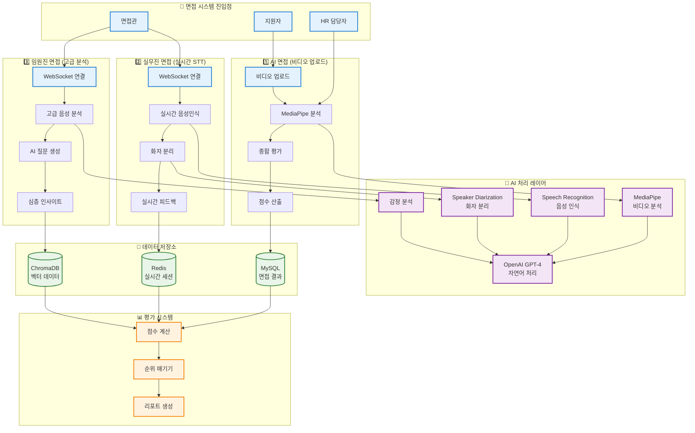
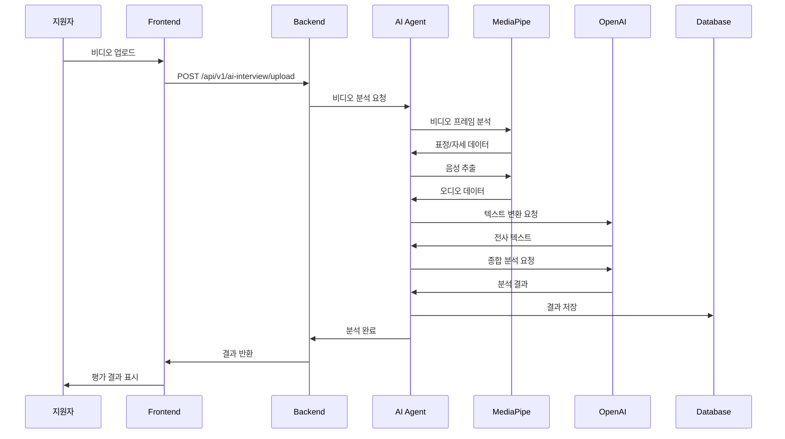
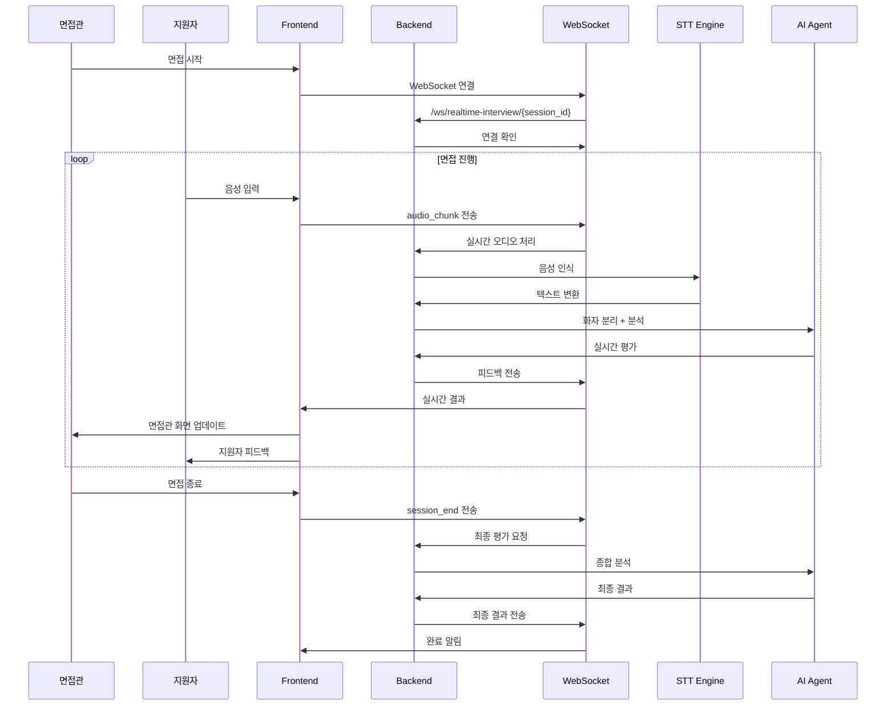
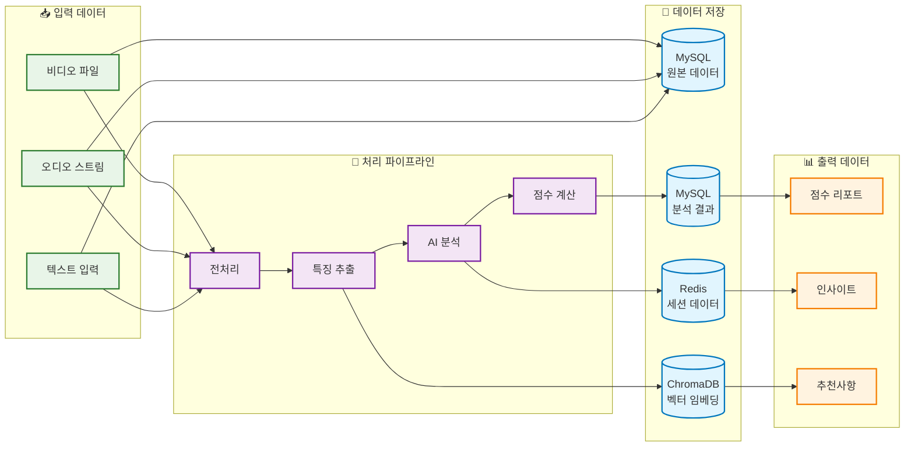

# 🎤 면접 시스템 상세 아키텍처

## 3단계 면접 시스템 전체 구조

## AI 면접 상세 워크플로우

## 실시간 면접 WebSocket 통신 플로우

## 면접 평가 기준 및 점수 체계

```mermaid
graph TD
    subgraph "📊 AI 면접 평가 (100점 만점)"
        AI_LANG[언어능력<br/>30점]
        AI_NONVERBAL[비언어적 행동<br/>25점]
        AI_PSYCH[심리적 특성<br/>20점]
        AI_COGNITIVE[인지능력<br/>15점]
        AI_JOB[직무 적합성<br/>10점]
    end
    
    subgraph "🎙️ 실시간 면접 평가"
        REALTIME_QUALITY[답변 품질<br/>40점]
        REALTIME_KEYWORD[키워드 매칭<br/>30점]
        REALTIME_EMOTION[감정 분석<br/>20점]
        REALTIME_FLOW[답변 흐름<br/>10점]
    end
    
    subgraph "👔 임원진 면접 평가"
        EXEC_LEADERSHIP[리더십<br/>25점]
        EXEC_STRATEGY[전략적 사고<br/>25점]
        EXEC_EXPERIENCE[경험 분석<br/>25점]
        EXEC_CULTURE[문화 적합성<br/>25점]
    end
    
    subgraph "🤖 AI 분석 도구"
        MEDIAPIPE_TOOLS[MediaPipe<br/>- 표정 분석<br/>- 자세 분석<br/>- 손동작 분석]
        OPENAI_TOOLS[OpenAI GPT-4<br/>- 텍스트 분석<br/>- 감정 분석<br/>- 키워드 추출]
        SPEECH_TOOLS[Speech Recognition<br/>- 음성 인식<br/>- 화자 분리<br/>- 톤 분석]
    end
    
    AI_LANG --> MEDIAPIPE_TOOLS
    AI_NONVERBAL --> MEDIAPIPE_TOOLS
    AI_PSYCH --> OPENAI_TOOLS
    AI_COGNITIVE --> OPENAI_TOOLS
    AI_JOB --> OPENAI_TOOLS
    
    REALTIME_QUALITY --> SPEECH_TOOLS
    REALTIME_KEYWORD --> OPENAI_TOOLS
    REALTIME_EMOTION --> OPENAI_TOOLS
    REALTIME_FLOW --> SPEECH_TOOLS
    
    EXEC_LEADERSHIP --> OPENAI_TOOLS
    EXEC_STRATEGY --> OPENAI_TOOLS
    EXEC_EXPERIENCE --> OPENAI_TOOLS
    EXEC_CULTURE --> OPENAI_TOOLS
    
    %% 스타일링
    classDef ai fill:#e3f2fd,stroke:#1976d2,stroke-width:2px
    classDef realtime fill:#f3e5f5,stroke:#7b1fa2,stroke-width:2px
    classDef executive fill:#e8f5e8,stroke:#2e7d32,stroke-width:2px
    classDef tools fill:#fff3e0,stroke:#f57c00,stroke-width:2px
    
    class AI_LANG,AI_NONVERBAL,AI_PSYCH,AI_COGNITIVE,AI_JOB ai
    class REALTIME_QUALITY,REALTIME_KEYWORD,REALTIME_EMOTION,REALTIME_FLOW realtime
    class EXEC_LEADERSHIP,EXEC_STRATEGY,EXEC_EXPERIENCE,EXEC_CULTURE executive
    class MEDIAPIPE_TOOLS,OPENAI_TOOLS,SPEECH_TOOLS tools
```

## 면접 데이터 플로우 및 저장 구조

## 면접 시스템 확장성 고려사항

### 🔧 기술적 확장성
- **마이크로서비스 아키텍처**: 각 면접 단계를 독립적인 서비스로 분리
- **로드 밸런싱**: 다수의 면접 세션 동시 처리
- **캐싱 전략**: Redis를 활용한 실시간 데이터 캐싱
- **비동기 처리**: WebSocket과 asyncio를 활용한 실시간 처리

### 📈 성능 최적화
- **병렬 처리**: 여러 분석 도구 동시 실행
- **스트리밍 처리**: 실시간 오디오/비디오 스트리밍
- **압축 기술**: 대용량 미디어 파일 효율적 처리
- **CDN 활용**: 글로벌 사용자를 위한 콘텐츠 배포

### 🔒 보안 및 프라이버시
- **데이터 암호화**: 민감한 면접 데이터 암호화 저장
- **접근 제어**: 역할 기반 접근 권한 관리
- **감사 로그**: 모든 면접 활동 추적 및 기록
- **GDPR 준수**: 개인정보 보호 규정 준수
