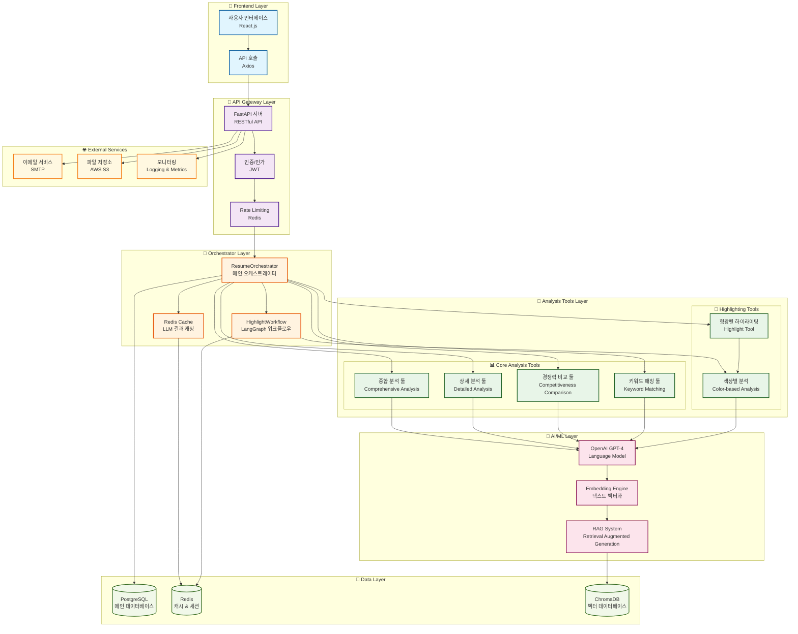
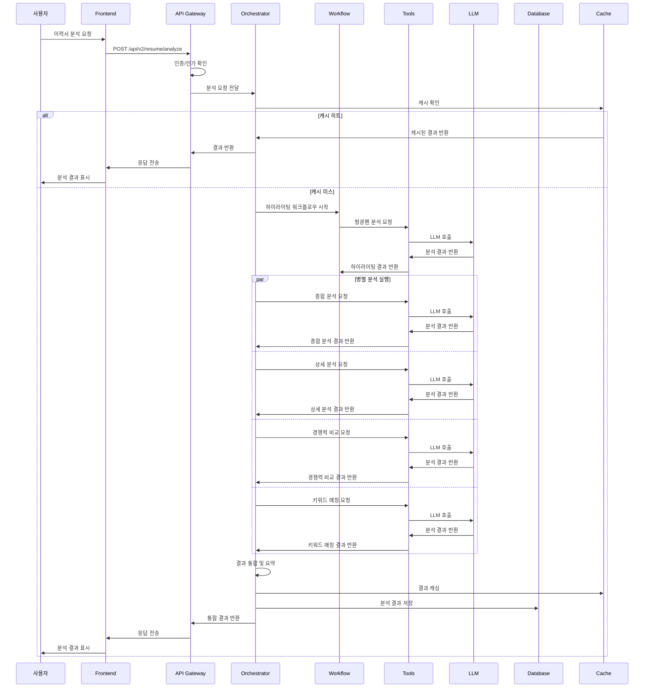
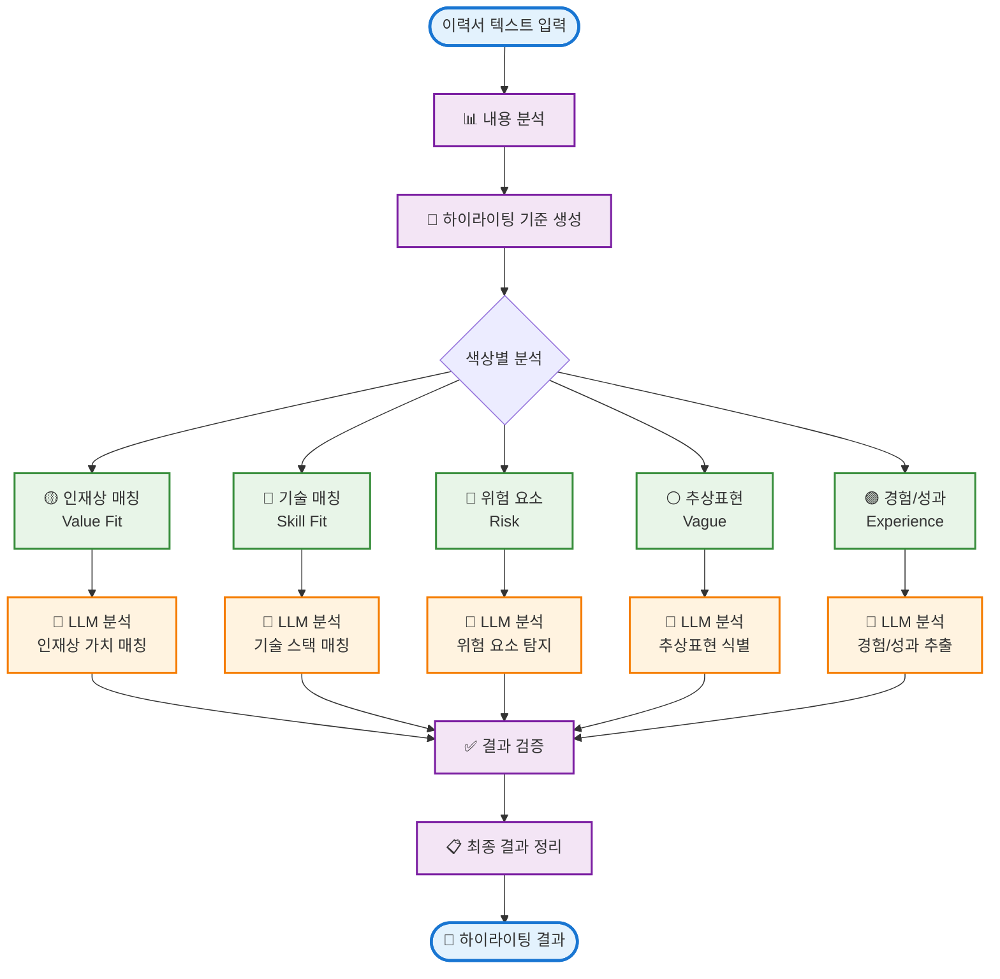
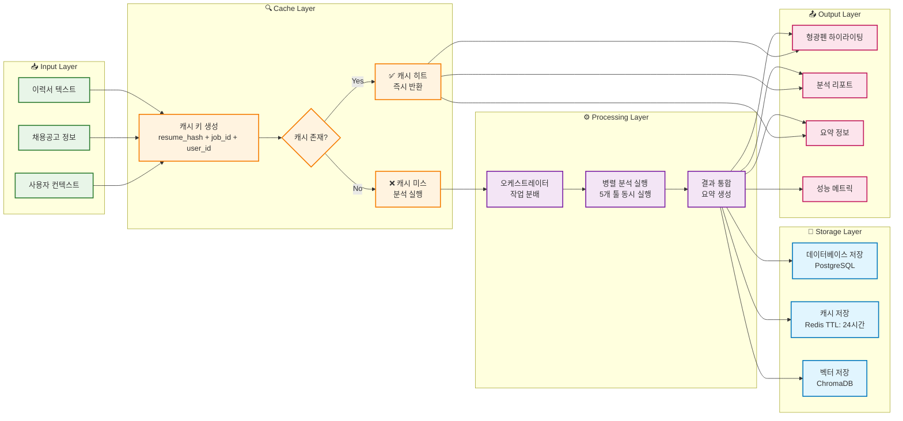
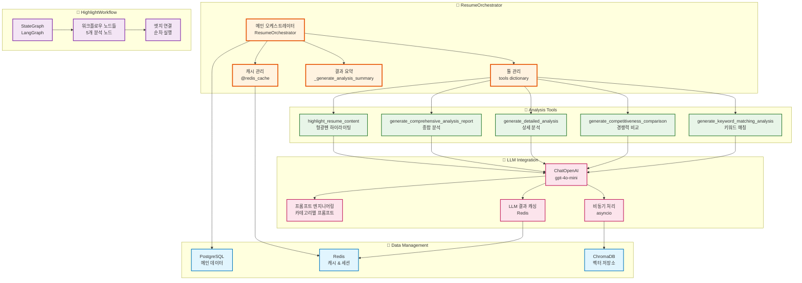

# 이력서 분석 시스템 - 상위 오케스트레이터 아키텍처

## 시스템 전체 구조 다이어그램

## 상세 워크플로우 다이어그램

## 🎨 형광펜 하이라이팅 시스템 상세 다이어그램

## 🔄 데이터 플로우 및 캐싱 전략

## 🏗️ 컴포넌트 아키텍처 상세도

## 컴포넌트 상세 설명

### 🎼 Orchestrator Layer
- **ResumeOrchestrator**: 전체 분석 프로세스를 조율하는 메인 컴포넌트
- **HighlightWorkflow**: LangGraph 기반의 형광펜 하이라이팅 워크플로우
- **Redis Cache**: LLM 호출 결과를 캐싱하여 성능 최적화

### 🔧 Analysis Tools Layer
- **종합 분석 툴**: 이력서의 전반적인 적합성과 매칭도 평가
- **상세 분석 툴**: 구체적인 역량과 경험을 세부적으로 분석
- **경쟁력 비교 툴**: 시장 평균 대비 경쟁력 분석
- **키워드 매칭 툴**: 채용공고 키워드와 이력서 내용 매칭
- **형광펜 하이라이팅**: 색상별로 의미있는 구절을 하이라이팅

### 🤖 AI/ML Layer
- **OpenAI GPT-4**: 자연어 처리 및 분석을 위한 LLM
- **Embedding Engine**: 텍스트를 벡터로 변환
- **RAG System**: 검색 기반 생성 시스템

### 💾 Data Layer
- **PostgreSQL**: 사용자, 이력서, 분석 결과 등 메인 데이터 저장
- **Redis**: 세션, 캐시, 임시 데이터 저장
- **ChromaDB**: 벡터 데이터베이스로 의미적 검색 지원

## 성능 최적화 전략

1. **캐싱 전략**: Redis를 활용한 LLM 결과 캐싱
2. **병렬 처리**: 여러 분석 툴을 동시에 실행
3. **비동기 처리**: asyncio를 활용한 비동기 워크플로우
4. **워크플로우 최적화**: LangGraph를 통한 효율적인 작업 흐름 관리

## 확장성 고려사항

- **모듈화된 툴 구조**: 새로운 분석 툴을 쉽게 추가 가능
- **마이크로서비스 준비**: 각 컴포넌트를 독립적으로 확장 가능
- **데이터베이스 분리**: 용도별 데이터베이스 분리로 성능 최적화
- **API 버전 관리**: 하위 호환성을 위한 API 버전 관리 