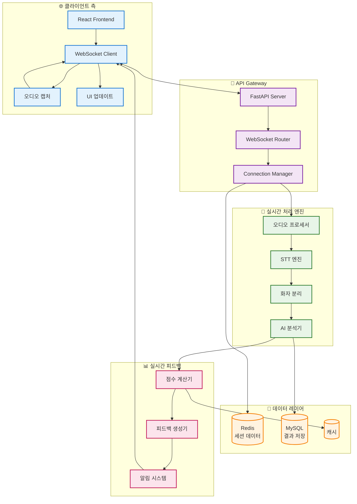
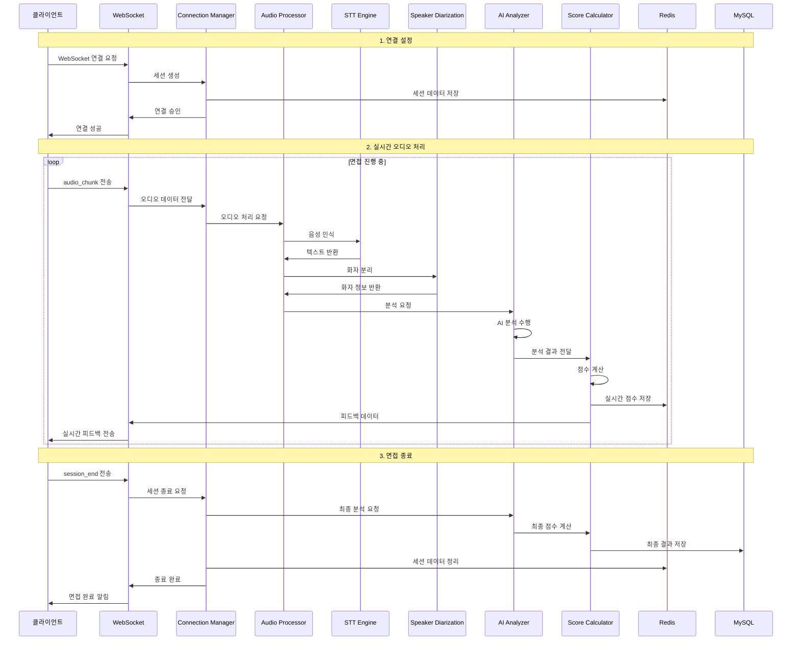
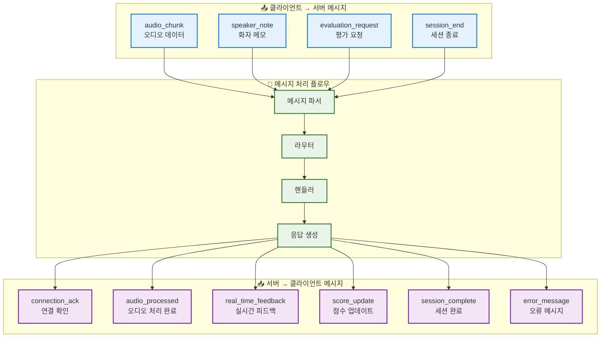
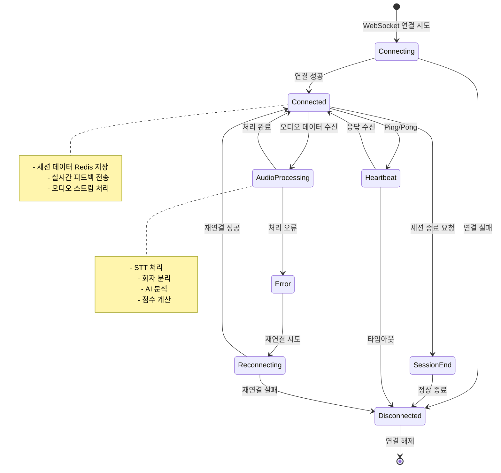

# 🔄 실시간 면접 WebSocket 통신 플로우

## WebSocket 연결 및 세션 관리

## WebSocket 메시지 플로우 시퀀스

## WebSocket 메시지 타입 및 구조

## 실시간 오디오 처리 파이프라인

```mermaid
graph LR
    subgraph "🎤 오디오 입력"
        MICROPHONE[마이크 입력]
        AUDIO_STREAM[오디오 스트림]
        CHUNK_SPLITTER[청크 분할]
    end
    
    subgraph "🔄 전처리"
        NOISE_REDUCTION[노이즈 제거]
        NORMALIZATION[정규화]
        FILTERING[필터링]
    end
    
    subgraph "🎯 음성 인식"
        STT_MODEL[STT 모델]
        TEXT_CONVERSION[텍스트 변환]
        CONFIDENCE_SCORE[신뢰도 점수]
    end
    
    subgraph "👥 화자 분리"
        VOICE_FEATURES[음성 특징 추출]
        SPEAKER_ID[화자 식별]
        SPEAKER_SEGMENTATION[화자 구간 분할]
    end
    
    subgraph "🤖 AI 분석"
        CONTENT_ANALYSIS[내용 분석]
        EMOTION_ANALYSIS[감정 분석]
        KEYWORD_EXTRACTION[키워드 추출]
    end
    
    subgraph "📊 실시간 평가"
        SCORE_CALCULATION[점수 계산]
        FEEDBACK_GENERATION[피드백 생성]
        REAL_TIME_UPDATE[실시간 업데이트]
    end
    
    MICROPHONE --> AUDIO_STREAM
    AUDIO_STREAM --> CHUNK_SPLITTER
    CHUNK_SPLITTER --> NOISE_REDUCTION
    NOISE_REDUCTION --> NORMALIZATION
    NORMALIZATION --> FILTERING
    FILTERING --> STT_MODEL
    STT_MODEL --> TEXT_CONVERSION
    TEXT_CONVERSION --> CONFIDENCE_SCORE
    CONFIDENCE_SCORE --> VOICE_FEATURES
    VOICE_FEATURES --> SPEAKER_ID
    SPEAKER_ID --> SPEAKER_SEGMENTATION
    SPEAKER_SEGMENTATION --> CONTENT_ANALYSIS
    CONTENT_ANALYSIS --> EMOTION_ANALYSIS
    EMOTION_ANALYSIS --> KEYWORD_EXTRACTION
    KEYWORD_EXTRACTION --> SCORE_CALCULATION
    SCORE_CALCULATION --> FEEDBACK_GENERATION
    FEEDBACK_GENERATION --> REAL_TIME_UPDATE
    
    %% 스타일링
    classDef input fill:#e8f5e8,stroke:#2e7d32,stroke-width:2px
    classDef preprocess fill:#f3e5f5,stroke:#7b1fa2,stroke-width:2px
    classDef stt fill:#e3f2fd,stroke:#1976d2,stroke-width:2px
    classDef speaker fill:#fff3e0,stroke:#f57c00,stroke-width:2px
    classDef ai fill:#fce4ec,stroke:#c2185b,stroke-width:2px
    classDef evaluation fill:#e1f5fe,stroke:#0277bd,stroke-width:2px
    
    class MICROPHONE,AUDIO_STREAM,CHUNK_SPLITTER input
    class NOISE_REDUCTION,NORMALIZATION,FILTERING preprocess
    class STT_MODEL,TEXT_CONVERSION,CONFIDENCE_SCORE stt
    class VOICE_FEATURES,SPEAKER_ID,SPEAKER_SEGMENTATION speaker
    class CONTENT_ANALYSIS,EMOTION_ANALYSIS,KEYWORD_EXTRACTION ai
    class SCORE_CALCULATION,FEEDBACK_GENERATION,REAL_TIME_UPDATE evaluation
```

## WebSocket 연결 상태 관리

## 성능 최적화 및 확장성

### 🚀 성능 최적화 전략
- **비동기 처리**: asyncio를 활용한 논블로킹 I/O
- **메모리 관리**: 오디오 청크 스트리밍으로 메모리 사용량 최적화
- **캐싱**: Redis를 활용한 세션 데이터 캐싱
- **압축**: WebSocket 메시지 압축으로 대역폭 절약

### 📈 확장성 고려사항
- **로드 밸런싱**: 다수의 WebSocket 서버 인스턴스 운영
- **세션 클러스터링**: Redis Cluster를 활용한 세션 공유
- **CDN 활용**: 글로벌 사용자를 위한 엣지 서버 배포
- **모니터링**: 실시간 연결 상태 및 성능 모니터링
