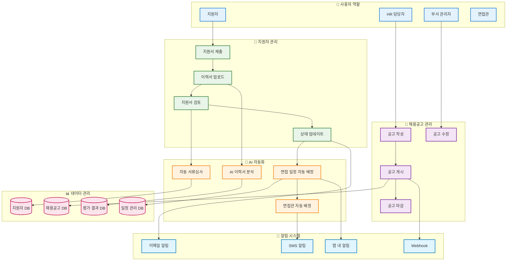
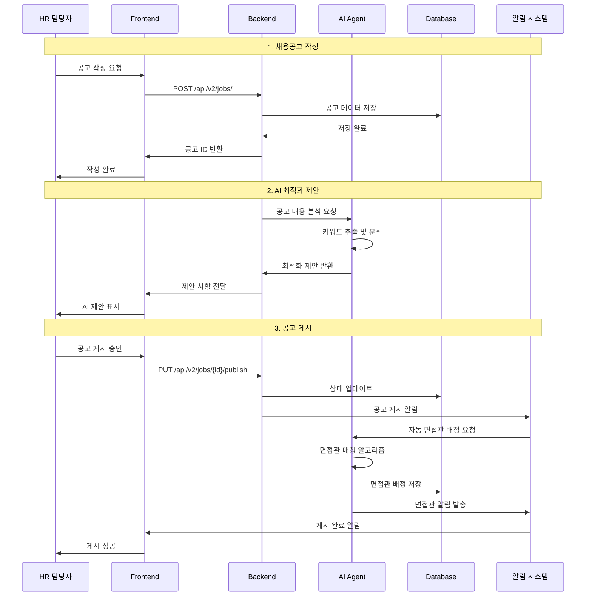
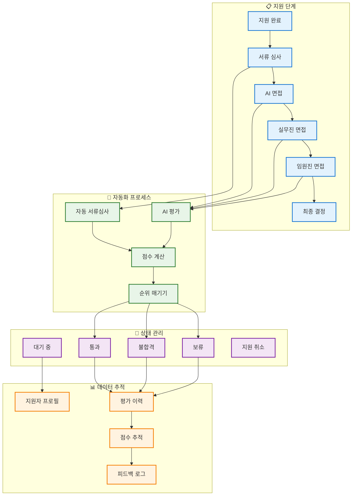
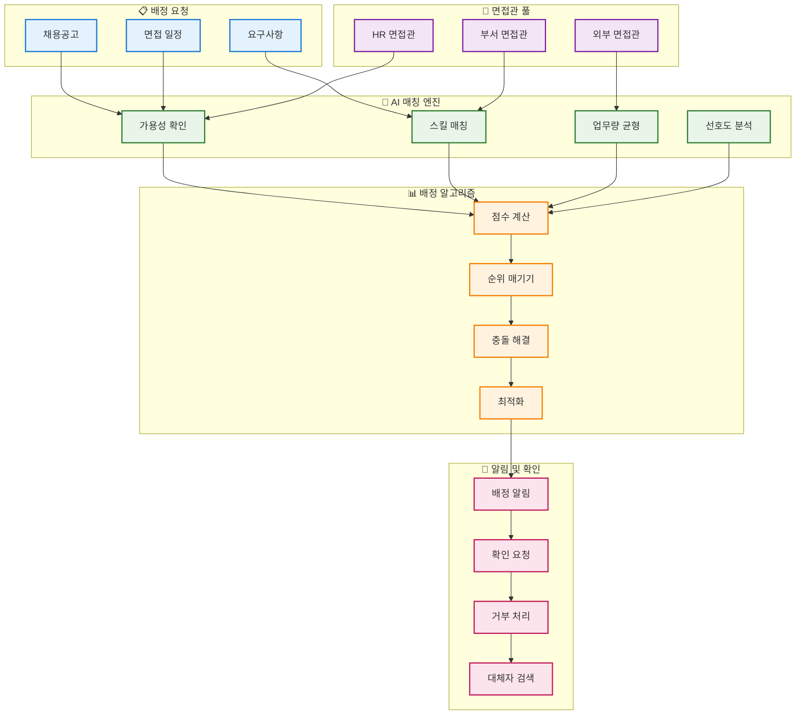
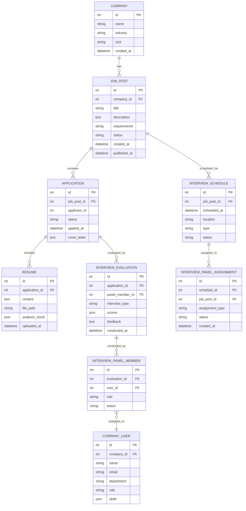
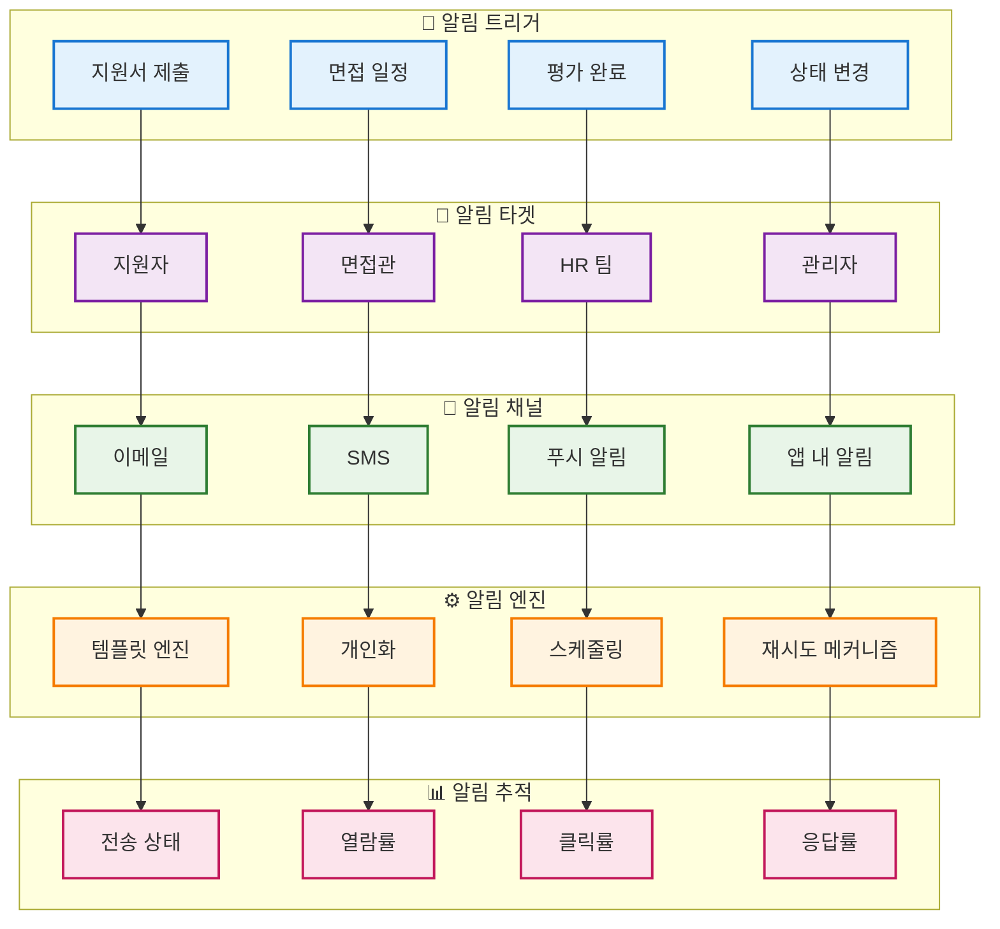

# 📋 채용공고 및 지원자 관리 시스템 아키텍처

## 전체 채용 관리 시스템 구조

## 채용공고 생성 및 관리 플로우

## 지원자 관리 및 상태 추적 시스템

## 면접관 자동 배정 시스템

## 데이터베이스 스키마 및 관계

## 알림 시스템 아키텍처

## 성능 최적화 및 확장성

### 🚀 성능 최적화
- **데이터베이스 인덱싱**: 자주 조회되는 필드에 인덱스 생성
- **캐싱 전략**: Redis를 활용한 세션 및 자주 조회되는 데이터 캐싱
- **비동기 처리**: 대용량 알림 발송을 위한 비동기 큐 시스템
- **CDN 활용**: 정적 자원 및 파일 배포 최적화

### 📈 확장성 고려사항
- **마이크로서비스 분리**: 채용공고, 지원자, 면접 관리 서비스 분리
- **로드 밸런싱**: 다수의 서버 인스턴스로 트래픽 분산
- **데이터베이스 샤딩**: 대용량 데이터 처리를 위한 수평 확장
- **메시지 큐**: 비동기 작업 처리를 위한 RabbitMQ/Kafka 활용
