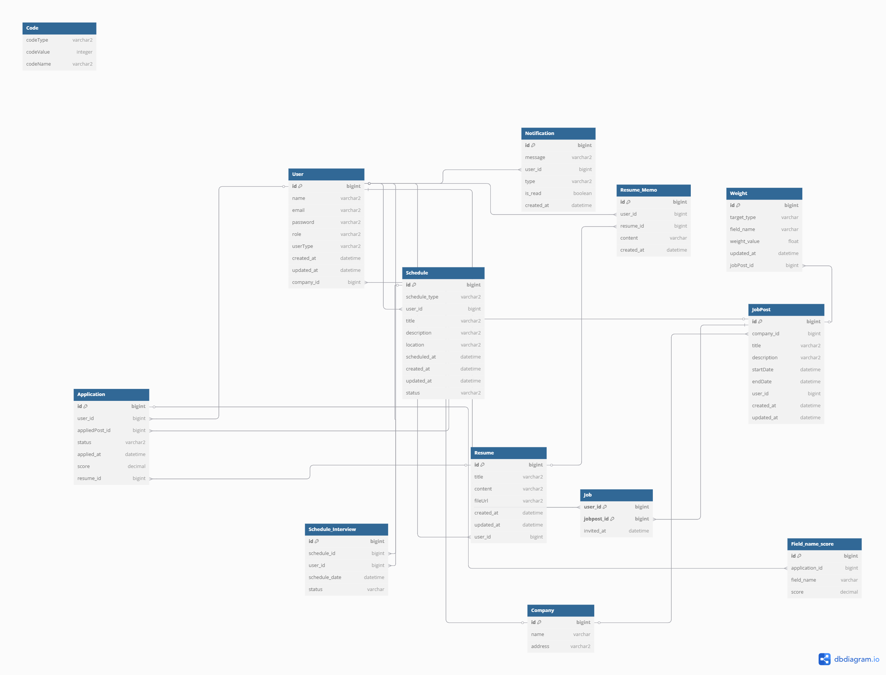

# ERD

# 테이블 정의서

 

### 테이블 정의서 요약

| **테이블명**             | **설명 요약**                                                  |
|--------------------------|-----------------------------------------------------------------|
| `USER`                   | 사용자 (개인/기업) 정보 저장. 로그인 계정, 권한, 소속 회사 등 포함 |
| `COMPANY`                | 기업 정보 (회사 이름, 주소 등)                                  |
| `JOBPOST`                | 채용공고 정보 (기업, 제목, 설명, 기간 등)                        |
| `APPLICATION`            | 지원 이력서 제출 정보 (상태, 점수, 공고 연결 등)                 |
| `RESUME`                 | 이력서 본문, 제목, 파일, 지원자 연결 등                          |
| `RESUME_MEMO`            | 이력서에 대한 기업측 메모                                        |
| `NOTIFICATION`           | 사용자 대상 알림 메시지 및 읽기 여부                             |
| `WEIGHT`                 | 채용공고별 평가 항목 및 가중치                                   |
| `SCHEDULE`               | 면접 등 스케줄 정보 (타입, 장소, 시간 포함)                      |
| `SCHEDULE_INTERVIEW`     | 스케줄에 연결된 실제 면접 대상자                                 |
| `JOB`                    | 특정 공고에 초대된 사용자 연결 테이블                            |
| `FIELD_NAME_SCORE`       | 개별 지원자 항목별 점수 저장 테이블                              |

 

### USER 테이블

  
USER 테이블 보기

| 필드명      | 타입                         | 설명              |
| ----------- | ---------------------------- | ----------------- |
| id          | PK, INT                      | 사용자 ID         |
| email       | VARCHAR                     | 이메일 (로그인 ID) |
| password    | VARCHAR                     | 비밀번호 (암호화 저장) |
| user_type   | ENUM('personal', 'corporate') | 사용자 유형       |
| name        | VARCHAR                     | 이름 or 기업명    |
| created_at  | DATETIME                   | 가입일자          |
| updated_at  | DATETIME                   | 수정일자          |
| role        | VARCHAR                     | 권한              |
| company_id  | FK, INT                    | 기업ID            |

 

---

### COMPANY 테이블

  
COMPANY 테이블 보기

| 필드명     | 타입      | 설명           |
| ---------- | --------- | -------------- |
| id         | PK, INT   | 기업 ID        |
| name       | VARCHAR   | 기업 이름      |
| address    | VARCHAR   | 주소 등 추가 정보 |

 

---

### JOBPOST 테이블

  
JOBPOST 테이블 보기

| 필드명     | 타입          | 설명           |
| ---------- | ------------- | -------------- |
| id         | PK, INT       | 공고 ID        |
| company_id | FK, INT       | 소속 기업      |
| title      | VARCHAR       | 공고 제목      |
| description| TEXT          | 공고 설명      |
| created_at | DATETIME      | 생성일         |
| updated_at | DATETIME      | 수정일         |
| startDate  | DATETIME      | 공고시작일     |
| endDate    | DATETIME      | 공고마감일     |
| user_id    | FK, INT       | 사용자 ID      |

 

---

### APPLICATION (지원한 이력) 테이블

  
APPLICATION (지원한 이력) 테이블 보기

| 필드명        | 타입                           | 설명                                  |
| ------------- | ------------------------------ | -------------------------------------|
| id            | PK, INT                       | 지원자 ID                            |
| user_id       | FK                            | 사용자ID (개인)                      |
| status        | VARCHAR (자바 ENUM)            | 서류 상태 ('applied', 'passed', 'rejected', 'pending') |
| job_post_id| FK, INT                      | 공고ID                              |
| resume_id     | FK, INT                      | 이력서ID                            |
| applied_at    | DATETIME                     | 이력서 등록날짜                     |
| score         | DECIMAL                      | 가중치에 따른 점수                  |

 

---

### RESUME (이력서) 테이블

  
RESUME (이력서) 테이블 보기

| 필드명      | 타입        | 설명            |
| ----------- | ----------- | --------------- |
| id          | PK, INT     | 이력서 ID       |
| applicant_id| FK          | 지원자ID        |
| title       | TEXT        | 이력서 제목     |
| created_at  | DATETIME    | 작성일          |
| fileUrl     | VARCHAR2    | 파일링크        |
| content     | VARCHAR2    | 이력서 내용     |
| updated_at  | DATETIME    | 수정일          |

 

---

### RESUME_MEMO 테이블

  
RESUME_MEMO 테이블 보기

| 필드명     | 타입      | 설명          |
| ---------- | --------- | ------------- |
| id         | PK, INT   | 메모 ID       |
| resume_id  | FK        | 이력서 ID     |
| user_id    | FK        | 메모 작성자   |
| content    | VARCHAR   | 메모 내용     |
| created_at | DATETIME  | 작성일        |

 

---

### NOTIFICATION 테이블

  
NOTIFICATION

| 필드명    | 타입       | 설명           |
| --------- | ---------- | -------------- |
| id        | PK, INT    | 알림 ID        |
| user_id   | FK         | 알림 대상      |
| type      | VARCHAR    | 알림 종류      |
| message   | TEXT       | 내용           |
| created_at| DATETIME   | 생성일         |
| is_read   | BOOLEAN    | 읽기 여부      |

 

---

### WEIGHT 테이블

  
WEIGHT

| 필드명       | 타입        | 설명                 |
| ------------ | ----------- | -------------------- |
| id           | PK, INT     | 가중치 ID            |
| jobpost_id   | FK, INT     | 공고ID               |
| target_type  | VARCHAR     | 평가 유형(단계)      |
| field_name   | VARCHAR     | 평가항목명           |
| weight_value | FLOAT       | 평가항목값           |
| updated_at   | DATETIME    | 수정일               |

 

---

### SCHEDULE_INTERVIEW 테이블

  
SCHEDULE_INTERVIEW

| 필드명       | 타입       | 설명          |
| ------------ | ---------- | ------------- |
| id           | PK, INT    | 면접일정 ID   |
| schedule_id  | FK, INT    | 일정ID       |
| user_id      | FK, INT    | 사용자 ID    |
| schedule_date| DATETIME   | 날짜         |
| status       | VARCHAR    | 상태         |

 

---

### SCHEDULE 테이블

  
SCHEDULE

| 필드명       | 타입       | 설명          |
| ------------ | ---------- | ------------- |
| id           | PK, INT    | 일정 ID       |
| schedule_type| VARCHAR    | 일정 종류     |
| user_id      | FK, INT    | 사용자ID      |
| title        | VARCHAR    | 제목          |
| description  | VARCHAR    | 일정 설명     |
| location     | VARCHAR    | 일정 장소     |
| scheduled_at | DATETIME   | 날짜          |
| created_at   | DATETIME   | 생성일        |
| updated_at   | DATETIME   | 수정일        |

 

---

### JOB 테이블

  
JOB

| 필드명     | 타입           | 설명          |
| ---------- | -------------- | ------------- |
| jobPost_id | PK, FK, INT    | 공고ID        |
| user_id    | PK, FK, INT    | 사용자 ID     |
| invited_at | DATETIME       | 초대된 날짜   |

 

---

### FIELD_NAME_SCORE 테이블

  
FIELD_NAME_SCORE

| 필드명       | 타입         | 설명         |
| ------------ | ------------ | ------------ |
| id           | PK, FK, INT  | 평가항목 ID  |
| application_id | FK, INT    | 지원서 ID    |
| field_name   | VARCHAR      | 평가항목명   |
| score        | DECIMAL      | 총 점수      |

 
