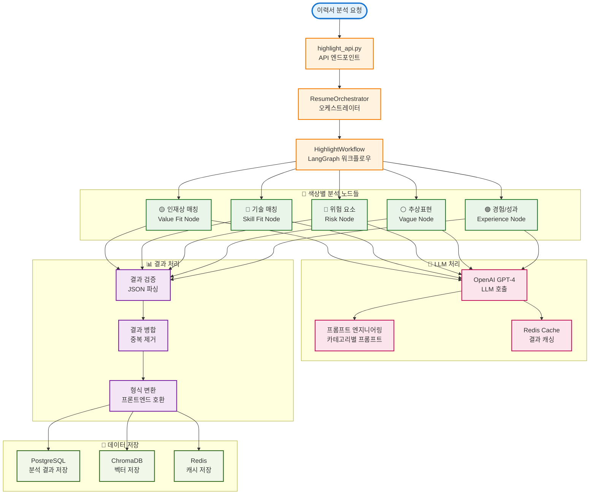
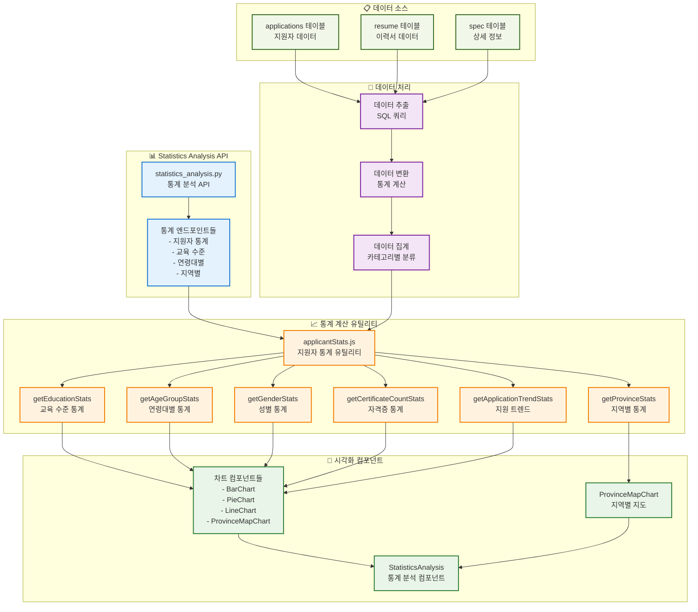
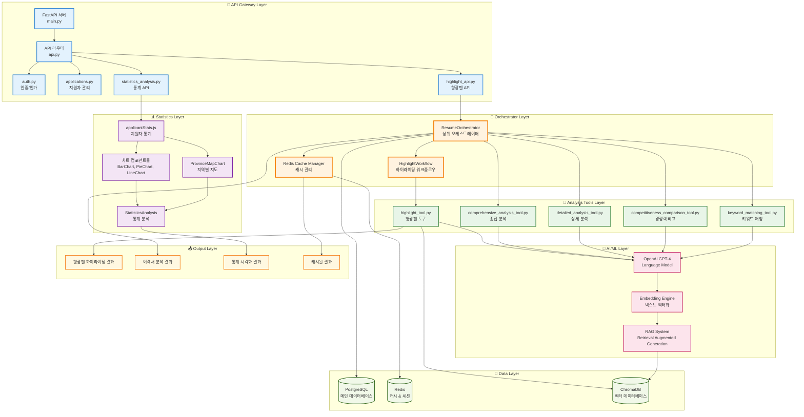
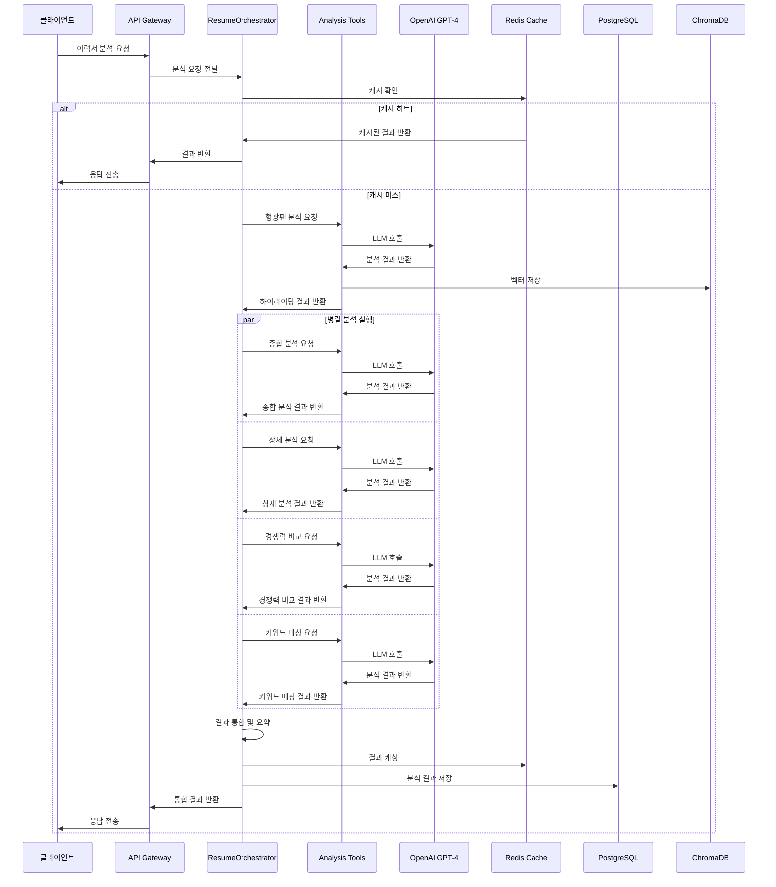

# 이력서 분석 시스템 - 백엔드 아키텍처 다이어그램

## 🚪 백엔드 API 라우터 구조

```mermaid
graph TB
    subgraph "🌐 FastAPI Main Server"
        MAIN[main.py<br/>FastAPI 애플리케이션]
        API_ROUTER[api.py<br/>메인 API 라우터]
    end
    
    subgraph "🔗 API 라우터들"
        AUTH[auth.py<br/>인증/인가]
        APPLICATIONS[applications.py<br/>지원자 관리]
        RESUMES[resumes.py<br/>이력서 관리]
        HIGHLIGHT[highlight_api.py<br/>형광펜 분석]
        STATISTICS[statistics_analysis.py<br/>통계 분석]
        AI_EVALUATE[ai_evaluate.py<br/>AI 평가]
        INTERVIEW[interview_question.py<br/>면접 질문]
        REALTIME[realtime_interview.py<br/>실시간 면접]
        COMPANIES[companies.py<br/>회사 관리]
        JOBS[company_jobs.py<br/>채용공고]
        SCHEDULES[schedules.py<br/>일정 관리]
        NOTIFICATIONS[notifications.py<br/>알림]
    end
    
    subgraph "🎼 Agent Layer"
        ORCH[resume_orchestrator.py<br/>상위 오케스트레이터]
        WORKFLOW[highlight_workflow.py<br/>하이라이팅 워크플로우]
    end
    
    subgraph "🔧 Analysis Tools"
        HIGHLIGHT_TOOL[highlight_tool.py<br/>형광펜 도구]
        COMPREHENSIVE[comprehensive_analysis_tool.py<br/>종합 분석]
        DETAILED[detailed_analysis_tool.py<br/>상세 분석]
        COMPETITIVENESS[competitiveness_comparison_tool.py<br/>경쟁력 비교]
        KEYWORD[keyword_matching_tool.py<br/>키워드 매칭]
    end
    
    subgraph "💾 Data Layer"
        DB[(PostgreSQL<br/>메인 DB)]
        REDIS[(Redis<br/>캐시)]
        CHROMA[(ChromaDB<br/>벡터 DB)]
    end
    
    MAIN --> API_ROUTER
    API_ROUTER --> AUTH
    API_ROUTER --> APPLICATIONS
    API_ROUTER --> RESUMES
    API_ROUTER --> HIGHLIGHT
    API_ROUTER --> STATISTICS
    API_ROUTER --> AI_EVALUATE
    API_ROUTER --> INTERVIEW
    API_ROUTER --> REALTIME
    API_ROUTER --> COMPANIES
    API_ROUTER --> JOBS
    API_ROUTER --> SCHEDULES
    API_ROUTER --> NOTIFICATIONS
    
    HIGHLIGHT --> ORCH
    STATISTICS --> ORCH
    AI_EVALUATE --> ORCH
    
    ORCH --> WORKFLOW
    ORCH --> HIGHLIGHT_TOOL
    ORCH --> COMPREHENSIVE
    ORCH --> DETAILED
    ORCH --> COMPETITIVENESS
    ORCH --> KEYWORD
    
    WORKFLOW --> HIGHLIGHT_TOOL
    
    ORCH --> DB
    ORCH --> REDIS
    HIGHLIGHT_TOOL --> CHROMA
    
    %% 스타일링
    classDef main fill:#e3f2fd,stroke:#1976d2,stroke-width:3px
    classDef router fill:#f3e5f5,stroke:#7b1fa2,stroke-width:2px
    classDef agent fill:#fff3e0,stroke:#f57c00,stroke-width:3px
    classDef tools fill:#e8f5e8,stroke:#2e7d32,stroke-width:2px
    classDef data fill:#f1f8e9,stroke:#33691e,stroke-width:2px
    
    class MAIN,API_ROUTER main
    class AUTH,APPLICATIONS,RESUMES,HIGHLIGHT,STATISTICS,AI_EVALUATE,INTERVIEW,REALTIME,COMPANIES,JOBS,SCHEDULES,NOTIFICATIONS router
    class ORCH,WORKFLOW agent
    class HIGHLIGHT_TOOL,COMPREHENSIVE,DETAILED,COMPETITIVENESS,KEYWORD tools
    class DB,REDIS,CHROMA data
```

## 🎼 ResumeOrchestrator 상위 오케스트레이터 아키텍처

```mermaid
graph TB
    subgraph "🎼 ResumeOrchestrator"
        ORCH_MAIN[ResumeOrchestrator<br/>메인 클래스]
        ORCH_CACHE[Redis Cache<br/>@redis_cache 데코레이터]
        ORCH_TOOLS[Tools Dictionary<br/>분석 도구 매핑]
        ORCH_SUMMARY[_generate_analysis_summary<br/>결과 요약 생성]
    end
    
    subgraph "📊 분석 메서드들"
        ANALYZE_COMPLETE[analyze_resume_complete<br/>완전한 분석]
        ANALYZE_SELECTIVE[analyze_resume_selective<br/>선택적 분석]
    end
    
    subgraph "🔧 분석 도구들"
        TOOL_HIGHLIGHT[highlight_resume_content<br/>형광펜 하이라이팅]
        TOOL_COMPREHENSIVE[generate_comprehensive_analysis_report<br/>종합 분석]
        TOOL_DETAILED[generate_detailed_analysis<br/>상세 분석]
        TOOL_COMPETITIVENESS[generate_competitiveness_comparison<br/>경쟁력 비교]
        TOOL_KEYWORD[generate_keyword_matching_analysis<br/>키워드 매칭]
    end
    
    subgraph "💾 데이터 관리"
        CACHE_MANAGER[Redis Cache Manager<br/>LLM 결과 캐싱]
        DB_CONNECTOR[Database Connector<br/>분석 결과 저장]
    end
    
    subgraph "📤 결과 구조"
        METADATA[metadata<br/>분석 메타데이터]
        RESULTS[results<br/>분석 결과]
        ERRORS[errors<br/>오류 정보]
        SUMMARY[summary<br/>요약 정보]
    end
    
    ORCH_MAIN --> ORCH_CACHE
    ORCH_MAIN --> ORCH_TOOLS
    ORCH_MAIN --> ORCH_SUMMARY
    
    ORCH_MAIN --> ANALYZE_COMPLETE
    ORCH_MAIN --> ANALYZE_SELECTIVE
    
    ANALYZE_COMPLETE --> TOOL_HIGHLIGHT
    ANALYZE_COMPLETE --> TOOL_COMPREHENSIVE
    ANALYZE_COMPLETE --> TOOL_DETAILED
    ANALYZE_COMPLETE --> TOOL_COMPETITIVENESS
    ANALYZE_COMPLETE --> TOOL_KEYWORD
    
    ANALYZE_SELECTIVE --> TOOL_HIGHLIGHT
    ANALYZE_SELECTIVE --> TOOL_COMPREHENSIVE
    ANALYZE_SELECTIVE --> TOOL_DETAILED
    ANALYZE_SELECTIVE --> TOOL_COMPETITIVENESS
    ANALYZE_SELECTIVE --> TOOL_KEYWORD
    
    ORCH_CACHE --> CACHE_MANAGER
    ORCH_SUMMARY --> DB_CONNECTOR
    
    ANALYZE_COMPLETE --> METADATA
    ANALYZE_COMPLETE --> RESULTS
    ANALYZE_COMPLETE --> ERRORS
    ANALYZE_COMPLETE --> SUMMARY
    
    %% 스타일링
    classDef orchestrator fill:#fff3e0,stroke:#f57c00,stroke-width:3px
    classDef methods fill:#f3e5f5,stroke:#7b1fa2,stroke-width:2px
    classDef tools fill:#e8f5e8,stroke:#2e7d32,stroke-width:2px
    classDef data fill:#e1f5fe,stroke:#0277bd,stroke-width:2px
    classDef results fill:#fce4ec,stroke:#c2185b,stroke-width:2px
    
    class ORCH_MAIN,ORCH_CACHE,ORCH_TOOLS,ORCH_SUMMARY orchestrator
    class ANALYZE_COMPLETE,ANALYZE_SELECTIVE methods
    class TOOL_HIGHLIGHT,TOOL_COMPREHENSIVE,TOOL_DETAILED,TOOL_COMPETITIVENESS,TOOL_KEYWORD tools
    class CACHE_MANAGER,DB_CONNECTOR data
    class METADATA,RESULTS,ERRORS,SUMMARY results
```

## 🎨 형광펜 하이라이팅 시스템 워크플로우

## 📊 지원자 통계시각화 시스템

## 🔧 이력서 분석도구들 상세 구조

```mermaid
graph TB
    subgraph "🔧 Analysis Tools Layer"
        subgraph "🎨 Highlight Tool"
            HIGHLIGHT_MAIN[highlight_resume_content<br/>메인 함수]
            HIGHLIGHT_CATEGORIES[색상별 카테고리<br/>- Yellow: 인재상<br/>- Blue: 기술<br/>- Red: 위험<br/>- Gray: 추상<br/>- Purple: 경험]
            HIGHLIGHT_LLM[LLM 호출<br/>OpenAI GPT-4]
            HIGHLIGHT_CACHE[Redis 캐싱<br/>@redis_cache]
        end
        
        subgraph "📊 Comprehensive Analysis"
            COMP_MAIN[generate_comprehensive_analysis_report<br/>종합 분석]
            COMP_SCORING[직무 매칭 점수<br/>0-100 점수]
            COMP_SUMMARY[이력서 요약<br/>핵심 내용 추출]
            COMP_RECOMMEND[추천사항<br/>개선 방향]
        end
        
        subgraph "🔍 Detailed Analysis"
            DETAIL_MAIN[generate_detailed_analysis<br/>상세 분석]
            DETAIL_SKILLS[기술 스택 분석<br/>기술별 평가]
            DETAIL_EXPERIENCE[경험 분석<br/>프로젝트별 평가]
            DETAIL_ASSESSMENT[전체 평가<br/>job_fit_score]
        end
        
        subgraph "⚔️ Competitiveness Comparison"
            COMPETE_MAIN[generate_competitiveness_comparison<br/>경쟁력 비교]
            COMPETE_MARKET[시장 평균 대비<br/>경쟁력 분석]
            COMPETE_SCORE[경쟁력 점수<br/>competitiveness_score]
            COMPETE_BENCHMARK[벤치마크<br/>동종 업계 비교]
        end
        
        subgraph "🔑 Keyword Matching"
            KEYWORD_MAIN[generate_keyword_matching_analysis<br/>키워드 매칭]
            KEYWORD_EXTRACT[키워드 추출<br/>채용공고 분석]
            KEYWORD_MATCH[매칭도 계산<br/>overall_match_score]
            KEYWORD_MISSING[부족한 키워드<br/>개선 제안]
        end
    end
    
    subgraph "🤖 LLM Integration"
        LLM_ENGINE[OpenAI GPT-4<br/>Language Model]
        PROMPT_TEMPLATES[프롬프트 템플릿<br/>도구별 최적화]
        ASYNC_PROCESSING[비동기 처리<br/>asyncio]
        ERROR_HANDLING[오류 처리<br/>예외 관리]
    end
    
    subgraph "💾 Data Management"
        CACHE_SYSTEM[Redis Cache<br/>결과 캐싱]
        DB_STORAGE[PostgreSQL<br/>분석 결과 저장]
        VECTOR_STORE[ChromaDB<br/>벡터 저장소]
    end
    
    HIGHLIGHT_MAIN --> HIGHLIGHT_CATEGORIES
    HIGHLIGHT_CATEGORIES --> HIGHLIGHT_LLM
    HIGHLIGHT_LLM --> HIGHLIGHT_CACHE
    
    COMP_MAIN --> COMP_SCORING
    COMP_MAIN --> COMP_SUMMARY
    COMP_MAIN --> COMP_RECOMMEND
    
    DETAIL_MAIN --> DETAIL_SKILLS
    DETAIL_MAIN --> DETAIL_EXPERIENCE
    DETAIL_MAIN --> DETAIL_ASSESSMENT
    
    COMPETE_MAIN --> COMPETE_MARKET
    COMPETE_MAIN --> COMPETE_SCORE
    COMPETE_MAIN --> COMPETE_BENCHMARK
    
    KEYWORD_MAIN --> KEYWORD_EXTRACT
    KEYWORD_MAIN --> KEYWORD_MATCH
    KEYWORD_MAIN --> KEYWORD_MISSING
    
    HIGHLIGHT_LLM --> LLM_ENGINE
    COMP_MAIN --> LLM_ENGINE
    DETAIL_MAIN --> LLM_ENGINE
    COMPETE_MAIN --> LLM_ENGINE
    KEYWORD_MAIN --> LLM_ENGINE
    
    LLM_ENGINE --> PROMPT_TEMPLATES
    LLM_ENGINE --> ASYNC_PROCESSING
    LLM_ENGINE --> ERROR_HANDLING
    
    HIGHLIGHT_CACHE --> CACHE_SYSTEM
    COMP_MAIN --> DB_STORAGE
    DETAIL_MAIN --> DB_STORAGE
    COMPETE_MAIN --> DB_STORAGE
    KEYWORD_MAIN --> DB_STORAGE
    
    HIGHLIGHT_LLM --> VECTOR_STORE
    
    %% 스타일링
    classDef tools fill:#e8f5e8,stroke:#2e7d32,stroke-width:2px
    classDef llm fill:#fce4ec,stroke:#c2185b,stroke-width:2px
    classDef data fill:#f1f8e9,stroke:#33691e,stroke-width:2px
    
    class HIGHLIGHT_MAIN,HIGHLIGHT_CATEGORIES,HIGHLIGHT_LLM,HIGHLIGHT_CACHE,COMP_MAIN,COMP_SCORING,COMP_SUMMARY,COMP_RECOMMEND,DETAIL_MAIN,DETAIL_SKILLS,DETAIL_EXPERIENCE,DETAIL_ASSESSMENT,COMPETE_MAIN,COMPETE_MARKET,COMPETE_SCORE,COMPETE_BENCHMARK,KEYWORD_MAIN,KEYWORD_EXTRACT,KEYWORD_MATCH,KEYWORD_MISSING tools
    class LLM_ENGINE,PROMPT_TEMPLATES,ASYNC_PROCESSING,ERROR_HANDLING llm
    class CACHE_SYSTEM,DB_STORAGE,VECTOR_STORE data
```

## 🔄 전체 시스템 통합 아키텍처

## 🔄 데이터 플로우 시퀀스 다이어그램

## 📋 컴포넌트 상세 설명

### 🎼 Orchestrator Layer
- **ResumeOrchestrator**: 전체 분석 프로세스를 조율하는 메인 컴포넌트
- **HighlightWorkflow**: LangGraph 기반의 형광펜 하이라이팅 워크플로우
- **Redis Cache**: LLM 호출 결과를 캐싱하여 성능 최적화

### 🔧 Analysis Tools Layer
- **형광펜 하이라이팅**: 색상별로 의미있는 구절을 하이라이팅
- **종합 분석**: 이력서의 전반적인 적합성과 매칭도 평가
- **상세 분석**: 구체적인 역량과 경험을 세부적으로 분석
- **경쟁력 비교**: 시장 평균 대비 경쟁력 분석
- **키워드 매칭**: 채용공고 키워드와 이력서 내용 매칭

### 📊 Statistics Layer
- **지원자 통계**: 교육 수준, 연령대별, 성별, 지역별 통계
- **차트 컴포넌트**: BarChart, PieChart, LineChart 등 시각화
- **지역별 지도**: ProvinceMapChart로 지역별 지원자 분포
- **통계 분석**: StatisticsAnalysis 컴포넌트로 통합 분석

### 🤖 AI/ML Layer
- **OpenAI GPT-4**: 자연어 처리 및 분석을 위한 LLM
- **Embedding Engine**: 텍스트를 벡터로 변환
- **RAG System**: 검색 기반 생성 시스템

### 💾 Data Layer
- **PostgreSQL**: 사용자, 이력서, 분석 결과 등 메인 데이터 저장
- **Redis**: 세션, 캐시, 임시 데이터 저장
- **ChromaDB**: 벡터 데이터베이스로 의미적 검색 지원

## 성능 최적화 전략

1. **캐싱 전략**: Redis를 활용한 LLM 결과 캐싱
2. **병렬 처리**: 여러 분석 툴을 동시에 실행
3. **비동기 처리**: asyncio를 활용한 비동기 워크플로우
4. **워크플로우 최적화**: LangGraph를 통한 효율적인 작업 흐름 관리

## 확장성 고려사항

- **모듈화된 툴 구조**: 새로운 분석 툴을 쉽게 추가 가능
- **마이크로서비스 준비**: 각 컴포넌트를 독립적으로 확장 가능
- **데이터베이스 분리**: 용도별 데이터베이스 분리로 성능 최적화
- **API 버전 관리**: 하위 호환성을 위한 API 버전 관리 