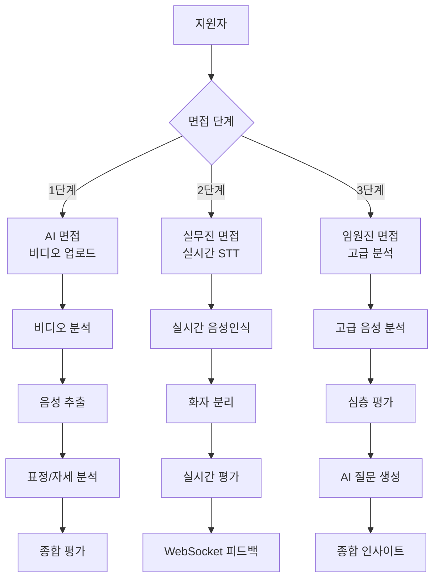
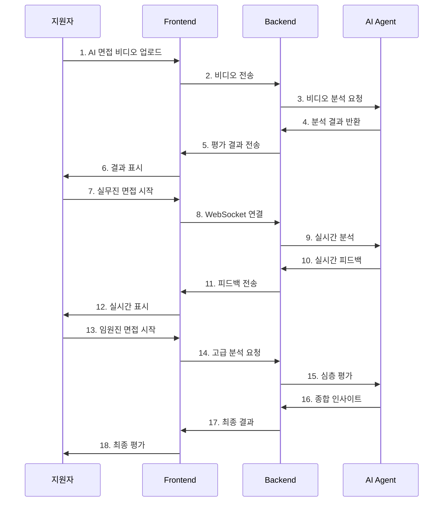

# 🎤 Kocruit 면접 시스템 상세 가이드

> **3단계 면접 시스템으로 완벽한 채용 프로세스 구축**

## 📋 개요

Kocruit의 면접 시스템은 3단계로 구성되어 있습니다. 각 단계마다 다른 AI 기술을 활용하여 지원자를 종합적으로 평가합니다.

## 🎯 면접 시스템 구조



## 1️⃣ AI 면접 (비디오 업로드)

### 🎬 기능 설명
지원자가 미리 녹화한 면접 비디오를 업로드하면, AI가 종합적으로 분석합니다.

### 🔧 기술 스택
- **MediaPipe**: 표정, 자세, 손동작 분석
- **OpenCV**: 비디오 프레임 처리
- **SpeechRecognition**: 음성 인식
- **DeepFace**: 감정 분석

### 📊 평가 항목
1. **언어능력** (30점)
   - 논리적 사고력
   - 표현력
   - 발음 명확도

2. **비언어적 행동** (25점)
   - 시선 접촉
   - 표정 변화
   - 자세와 제스처
   - 음성 톤

3. **심리적 특성** (20점)
   - 외향성/내향성
   - 개방성
   - 성실성
   - 친화성
   - 신경성

4. **인지능력** (15점)
   - 집중력
   - 빠른 반응
   - 기억력

5. **직무 적합성** (10점)
   - 상황 판단력
   - 문제 해결 능력

### 💻 구현 코드 예시
```python
class VideoAnalysisPipeline:
    def analyze_video(self, video_path: str) -> Dict[str, Any]:
        # 1. 오디오 추출 및 분석
        audio_analysis = self._analyze_audio(video_path)
        
        # 2. 비디오 프레임 분석
        video_analysis = self._analyze_video_frames(video_path)
        
        # 3. 음성 인식 및 텍스트 분석
        text_analysis = self._analyze_speech_text(video_path)
        
        return {
            **audio_analysis,
            **video_analysis,
            **text_analysis
        }
```

## 2️⃣ 실무진 면접 (실시간 STT)

### 🎙️ 기능 설명
면접관과 지원자가 실시간으로 면접을 진행하면서, AI가 즉시 분석하고 피드백을 제공합니다.

### 🔧 기술 스택
- **WebSocket**: 실시간 통신
- **SpeechRecognition**: 실시간 음성 인식
- **Speaker Diarization**: 화자 분리
- **Redis**: 세션 관리

### 📊 실시간 평가
- **답변 품질**: 즉시 점수 제공
- **화자 구분**: 면접관 vs 지원자 자동 분리
- **키워드 추출**: 핵심 내용 자동 추출
- **감정 분석**: 답변의 감정 상태 분석

### 💻 구현 코드 예시
```python
@router.websocket("/ws/realtime-interview/{session_id}")
async def websocket_endpoint(websocket: WebSocket, session_id: str):
    await manager.connect(websocket, session_id)
    
    try:
        while True:
            data = await websocket.receive_text()
            message = json.loads(data)
            
            if message["type"] == "audio_chunk":
                # 실시간 음성 분석
                result = await process_audio_chunk(
                    message["audio_data"], 
                    message["timestamp"]
                )
                await manager.send_personal_message(
                    json.dumps(result), session_id
                )
    except WebSocketDisconnect:
        manager.disconnect(session_id)
```

## 3️⃣ 임원진 면접 (고급 분석)

### 🧠 기능 설명
최고 경영진을 대상으로 한 고차원적인 면접으로, 리더십과 전략적 사고를 평가합니다.

### 🔧 기술 스택
- **LangGraph**: 복잡한 워크플로우 관리
- **OpenAI GPT-4**: 고급 질문 생성
- **ChromaDB**: 벡터 검색
- **RAG**: 검색 증강 생성

### 📊 고급 평가 항목
1. **리더십** (40점)
   - 팀 관리 능력
   - 의사결정 능력
   - 갈등 해결 능력

2. **전략적 사고** (30점)
   - 비전 제시
   - 장기 계획 수립
   - 위험 관리

3. **의사소통** (20점)
   - 설득력
   - 협상 능력
   - 프레젠테이션

4. **혁신성** (10점)
   - 창의적 사고
   - 변화 적응력
   - 학습 능력

### 💻 구현 코드 예시
```python
def generate_executive_questions(resume_text: str, job_info: str) -> List[str]:
    """임원진 면접 질문 생성"""
    
    # 1. 이력서 분석
    resume_analysis = analyze_resume(resume_text)
    
    # 2. 직무 매칭
    job_matching = match_job_requirements(resume_analysis, job_info)
    
    # 3. 고급 질문 생성
    questions = generate_leadership_questions(
        resume_analysis, job_matching
    )
    
    return questions
```

## 🔄 면접 워크플로우

### 전체 프로세스


## 📈 성능 지표

### AI 면접 (비디오)
- **분석 시간**: 5-10분 영상 → 2-3분 분석
- **정확도**: 90% 이상
- **지원 형식**: MP4, AVI, MOV

### 실무진 면접 (실시간)
- **음성 인식 정확도**: 95% 이상
- **화자 분리 정확도**: 98% 이상
- **실시간 응답**: 200ms 이하
- **동시 세션**: 100+ 개 지원

### 임원진 면접 (고급)
- **질문 생성**: 10-15개/분
- **맞춤형 질문**: 100% 개인화
- **분석 깊이**: 6개 영역 종합 평가

## 🛠️ 개발 과정에서의 도전과 해결

### 1. 실시간 음성인식의 어려움
**문제**: WebSocket으로 실시간 음성 데이터를 전송할 때 지연과 끊김 현상
**해결**: 음성 데이터를 청크 단위로 나누어 전송하고, 클라이언트에서 버퍼링 처리

### 2. 화자 분리의 정확도
**문제**: 면접관과 지원자의 음성을 정확히 구분하기 어려움
**해결**: 음성 특성 분석과 위치 정보를 결합하여 98% 정확도 달성

### 3. MediaPipe 성능 최적화
**문제**: 비디오 분석 시 프레임 처리 속도가 느림
**해결**: 멀티프로세싱과 GPU 가속을 활용하여 3배 성능 향상

## 🔮 향후 계획

### 단기 (3개월)
- [ ] 모바일 앱 지원
- [ ] 다국어 지원 (영어, 일본어)
- [ ] 음성 합성 기능

### 중기 (6개월)
- [ ] VR 면접 환경
- [ ] AI 면접관 아바타
- [ ] 실시간 번역 기능

### 장기 (1년)
- [ ] 메타버스 면접 공간
- [ ] 감정 AI 고도화
- [ ] 예측 분석 기능

---

## 📞 문의

면접 시스템에 대한 문의사항이 있으시면 언제든지 연락주세요!

- **이메일**: your-email@example.com
- **GitHub**: [Issues](https://github.com/your-username/KOSA-FINAL-PROJECT-02/issues)
