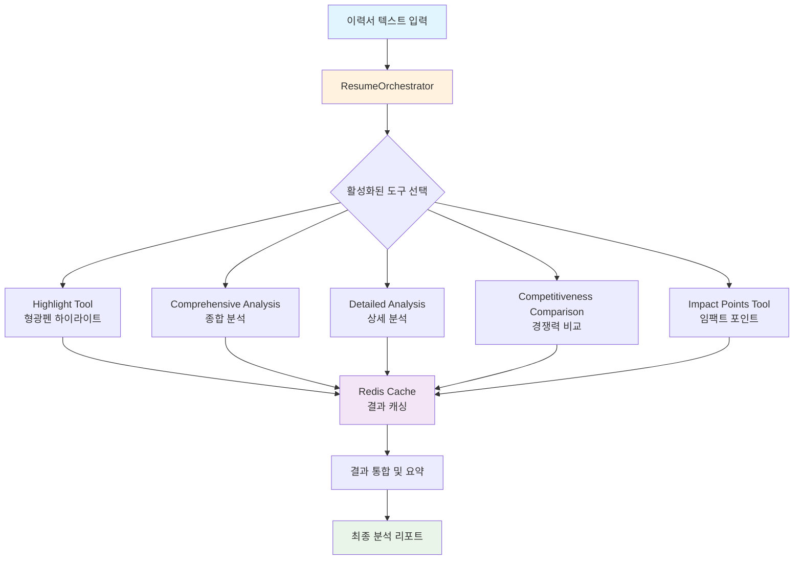
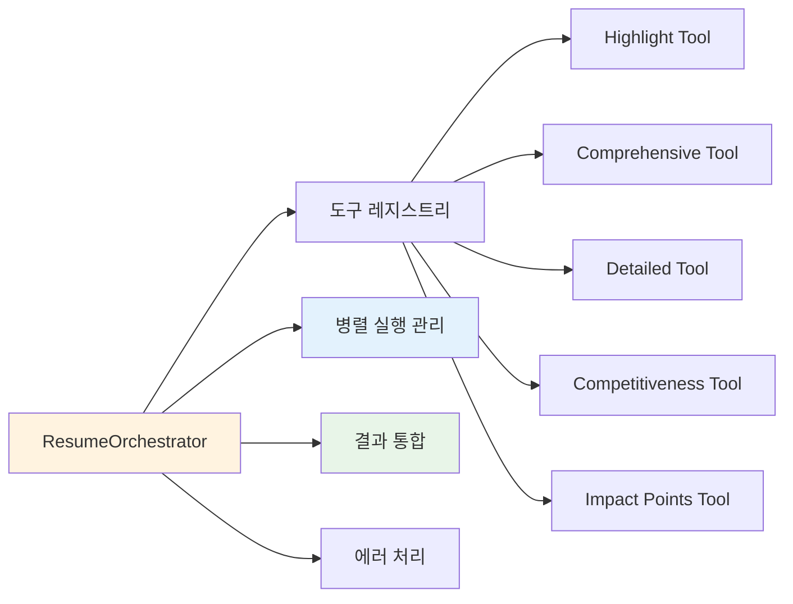
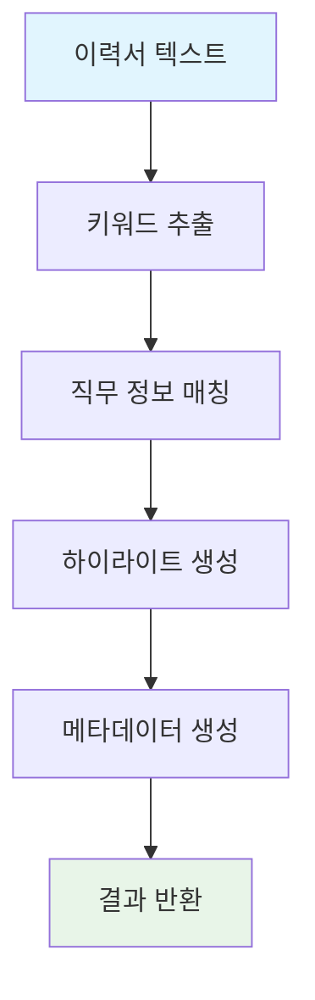
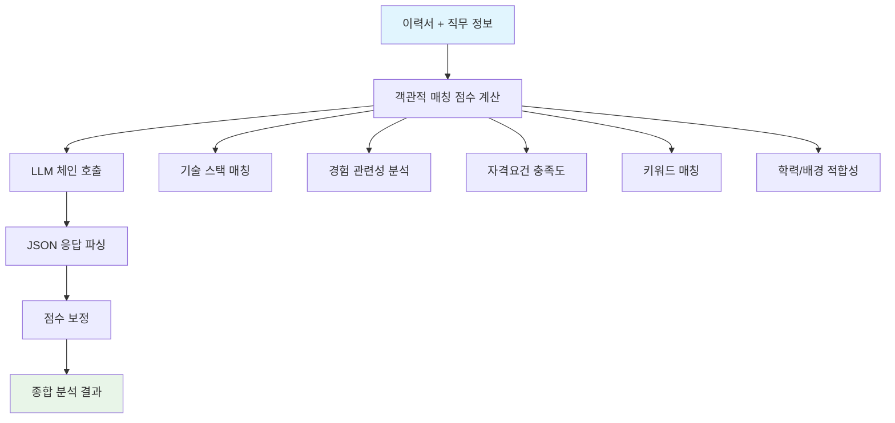
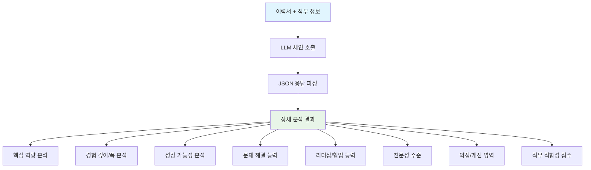
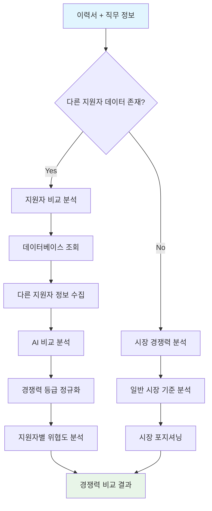
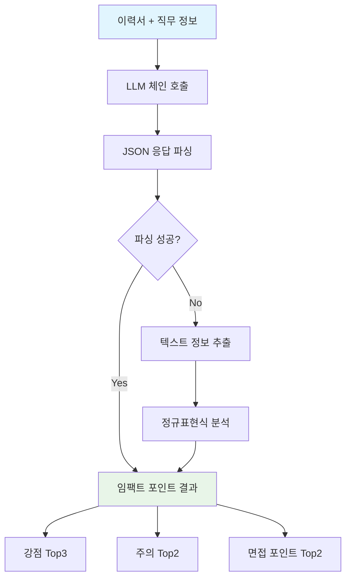
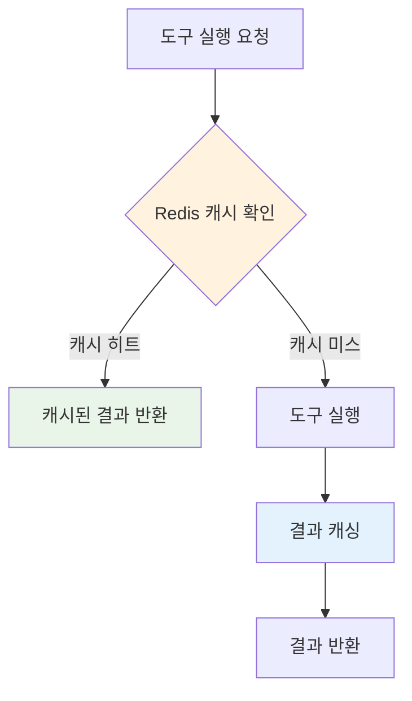
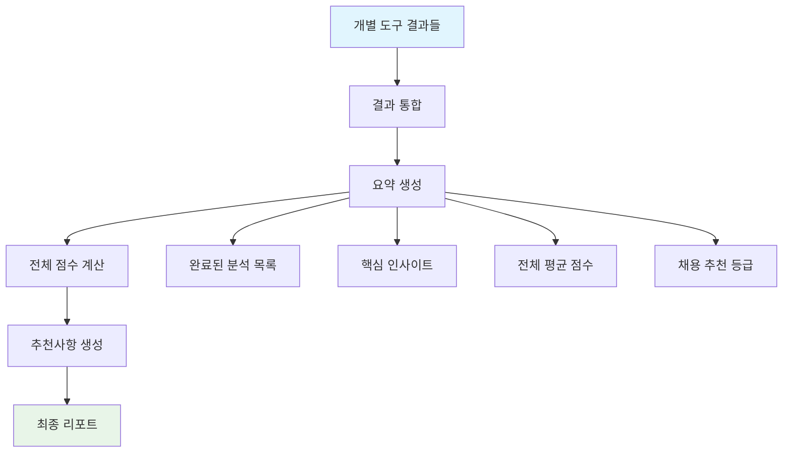

# 이력서 분석 도구 워크플로우 다이어그램

## 전체 워크플로우 개요



## 상세 워크플로우 분석

### 1. 입력 단계
```
이력서 텍스트 + 직무 정보 + 포트폴리오 정보 + 직무 매칭 정보
```

### 2. 오케스트레이터 단계
**ResumeOrchestrator**가 모든 분석 도구를 관리하고 조율합니다.



### 3. 개별 도구 실행 흐름

#### 3.1 Highlight Tool (형광펜 하이라이트)


#### 3.2 Comprehensive Analysis Tool (종합 분석)


#### 3.3 Detailed Analysis Tool (상세 분석)


#### 3.4 Competitiveness Comparison Tool (경쟁력 비교)


#### 3.5 Impact Points Tool (임팩트 포인트)


### 4. 캐싱 및 성능 최적화



### 5. 결과 통합 및 요약



## 데이터 흐름 상세 분석

### 입력 데이터 구조
```python
{
    "resume_text": "이력서 텍스트",
    "job_info": "직무 정보",
    "portfolio_info": "포트폴리오 정보",
    "job_matching_info": "직무 매칭 정보",
    "application_id": 123,
    "jobpost_id": 456,
    "company_id": 789,
    "enable_tools": ["highlight", "comprehensive", "detailed", "competitiveness", "impact_points"]
}
```

### 출력 데이터 구조
```python
{
    "metadata": {
        "analysis_timestamp": 1234567890,
        "enabled_tools": ["highlight", "comprehensive"],
        "application_id": 123,
        "jobpost_id": 456,
        "company_id": 789,
        "total_processing_time": 15.5
    },
    "results": {
        "highlight": { /* 형광펜 결과 */ },
        "comprehensive": { /* 종합 분석 결과 */ },
        "detailed": { /* 상세 분석 결과 */ },
        "competitiveness": { /* 경쟁력 비교 결과 */ },
        "impact_points": { /* 임팩트 포인트 결과 */ }
    },
    "errors": {
        "tool_name": "에러 메시지"
    },
    "summary": {
        "completed_analyses": ["highlight", "comprehensive"],
        "analysis_count": 2,
        "key_insights": ["핵심 인사이트 1", "핵심 인사이트 2"],
        "overall_scores": {
            "comprehensive_score": 85,
            "detailed_score": 82,
            "average_score": 83.5
        },
        "recommendations": ["강력 추천 - 우수한 후보자"]
    }
}
```

## 성능 최적화 포인트

### 1. 병렬 실행
- 각 도구는 독립적으로 실행되어 병렬 처리 가능
- `asyncio`를 활용한 비동기 처리

### 2. 캐싱 전략
- Redis를 활용한 결과 캐싱
- 도구별 개별 캐싱 (30분 ~ 1시간)
- 캐시 키: `tool_name:resume_hash:job_hash`

### 3. 선택적 실행
- `enable_tools` 파라미터로 필요한 도구만 실행
- 불필요한 분석 제외로 성능 향상

### 4. 에러 격리
- 개별 도구 실패가 전체 분석에 영향 주지 않음
- 에러 정보를 별도로 수집하여 디버깅 지원

## 확장성 및 유지보수성

### 1. 새로운 도구 추가
```python
# tools 딕셔너리에 새 도구 추가
self.tools['new_tool'] = new_tool_function
```

### 2. 도구별 설정 관리
- 각 도구는 독립적인 설정 가능
- 공통 인터페이스로 표준화

### 3. 모니터링 및 로깅
- 각 단계별 실행 시간 측정
- 에러 발생 시 상세 로그 기록
- 성능 메트릭 수집

## 결론

이력서 분석 워크플로우는 **오케스트레이터 패턴**을 기반으로 설계되어 다음과 같은 장점을 제공합니다:

1. **모듈화**: 각 도구가 독립적으로 개발/테스트 가능
2. **확장성**: 새로운 분석 도구 쉽게 추가 가능
3. **성능**: 병렬 실행과 캐싱으로 최적화
4. **안정성**: 에러 격리와 복구 메커니즘
5. **유지보수성**: 명확한 책임 분리와 표준화된 인터페이스

이 구조를 통해 다양한 이력서 분석 요구사항을 효율적으로 처리할 수 있습니다. 