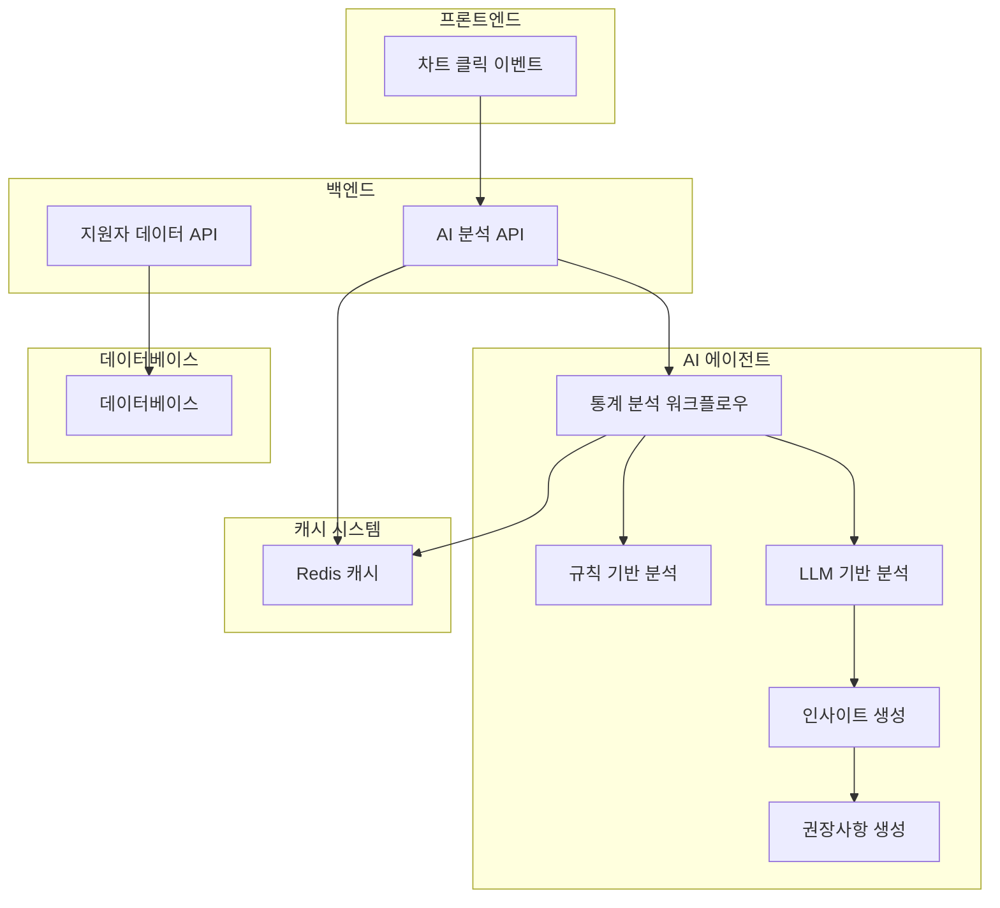
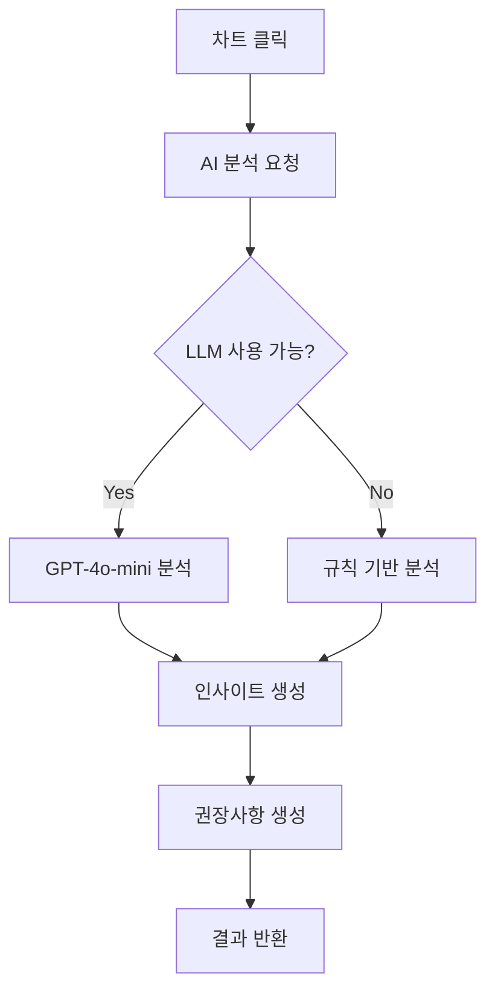
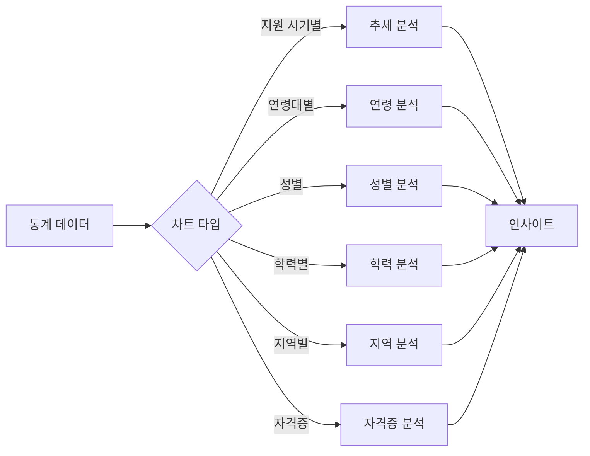

# 통계시각화 및 AI 분석 워크플로우 다이어그램

## 전체 시스템 아키텍처

## 핵심 워크플로우

### 1. AI 분석 프로세스

### 2. 분석 타입별 처리

## 주요 특징

- **이중 분석**: LLM + 규칙 기반
- **6가지 차트**: 지원 시기별, 연령대별, 성별, 학력별, 지역별, 자격증별
- **캐싱**: Redis로 성능 최적화
- **폴백**: LLM 장애 시 규칙 기반으로 대체 