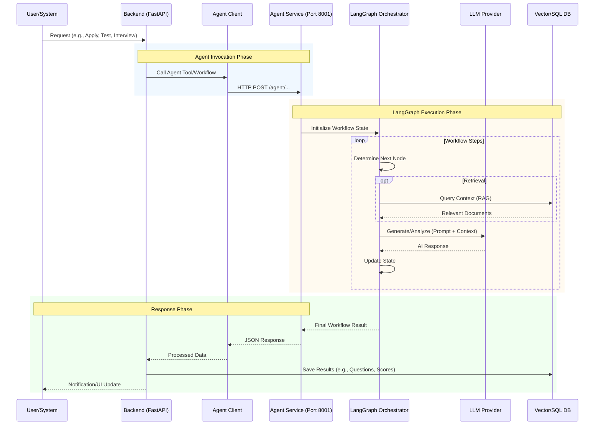

# Overall AI Agent Workflow

이 문서는 전체 시스템 내에서 AI Agent가 동작하는 워크플로우를 설명합니다.

```mermaid
sequenceDiagram
    participant User as User/System
    participant Backend as Backend (FastAPI)
    participant AgentClient as Agent Client
    participant AgentSvc as Agent Service (Port 8001)
    participant LangGraph as LangGraph Orchestrator
    participant LLM as LLM Provider
    participant DB as Vector/SQL DB

    User->>Backend: Request (e.g., Apply, Test, Interview)
    
    rect rgb(240, 248, 255)
        Note over Backend, AgentSvc: Agent Invocation Phase
        Backend->>AgentClient: Call Agent Tool/Workflow
        AgentClient->>AgentSvc: HTTP POST /agent/...
    end

    rect rgb(255, 250, 240)
        Note over AgentSvc, DB: LangGraph Execution Phase
        AgentSvc->>LangGraph: Initialize Workflow State
        
        loop Workflow Steps
            LangGraph->>LangGraph: Determine Next Node
            
            opt Retrieval
                LangGraph->>DB: Query Context (RAG)
                DB-->>LangGraph: Relevant Documents
            end

            LangGraph->>LLM: Generate/Analyze (Prompt + Context)
            LLM-->>LangGraph: AI Response
            
            LangGraph->>LangGraph: Update State
        end
    end

    rect rgb(240, 255, 240)
        Note over AgentSvc, User: Response Phase
        LangGraph-->>AgentSvc: Final Workflow Result
        AgentSvc-->>AgentClient: JSON Response
        AgentClient-->>Backend: Processed Data
        Backend->>DB: Save Results (e.g., Questions, Scores)
        Backend-->>User: Notification/UI Update
    end
```
