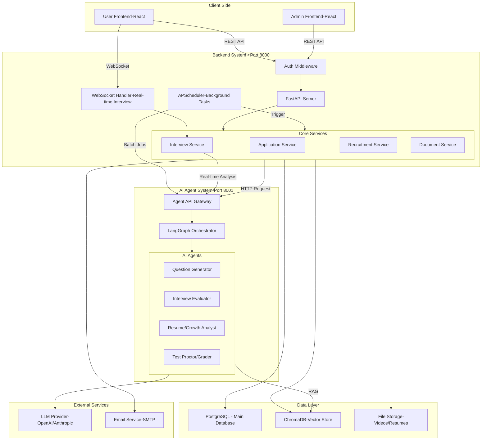

# Overall Architecture Workflow

이 문서는 시스템의 전체 아키텍처 워크플로우를 설명합니다.

```mermaid
graph TD
    subgraph Client [Client Side]
        User[User Frontend-React]
        Admin[Admin Frontend-React]
    end

    subgraph Server [Backend System - Port 8000]
        API[FastAPI Server]
        Auth[Auth Middleware]
        Scheduler[APScheduler-Background Tasks]
        WS[WebSocket Handler-Real-time Interview]
        
        subgraph Services [Core Services]
            AppSvc[Application Service]
            IntSvc[Interview Service]
            RecSvc[Recruitment Service]
            DocSvc[Document Service]
        end
    end

    subgraph Data [Data Layer]
        DB[PostgreSQL - Main Database]
        VectorDB[ChromaDB-Vector Store]
        FileStore[File Storage-Videos/Resumes]
    end

    subgraph AISystem [AI Agent System-Port 8001]
        AgentAPI[Agent API Gateway]
        LangGraph[LangGraph Orchestrator]
        
        subgraph Agents [AI Agents]
            QGen[Question Generator]
            Evaluator[Interview Evaluator]
            Analyst[Resume/Growth Analyst]
            Proctor[Test Proctor/Grader]
        end
    end

    subgraph External [External Services]
        LLM[LLM Provider-OpenAI/Anthropic]
        Email[Email Service-SMTP]
    end

    %% Client Interactions
    User -->|REST API| Auth
    Admin -->|REST API| Auth
    Auth --> API
    User -->|WebSocket| WS

    %% Backend Flows
    API --> Services
    WS --> IntSvc
    Services --> DB
    Services --> VectorDB
    Services --> FileStore
    
    %% Scheduler Flows
    Scheduler -->|Trigger| Services
    Scheduler -->|Batch Jobs| AgentAPI

    %% AI Integration
    Services -->|HTTP Request| AgentAPI
    IntSvc -->|Real-time Analysis| AgentAPI
    
    %% AI System Internals
    AgentAPI --> LangGraph
    LangGraph --> Agents
    Agents --> LLM
    Agents -->|RAG| VectorDB

    %% Notifications
    Services --> Email
```
