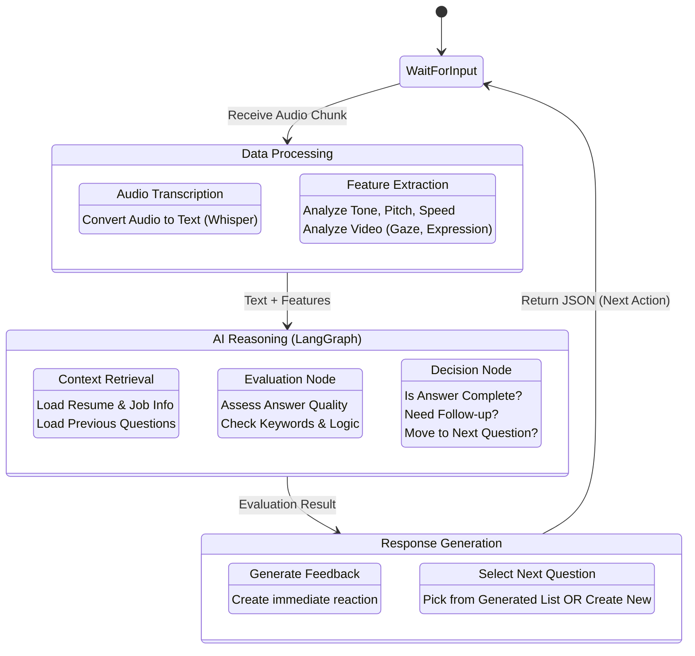

# Interview Part AI Agent Workflow

이 문서는 면접 진행 중 AI Agent가 어떻게 판단하고 상호작용하는지 상세 워크플로우를 설명합니다.

```mermaid
stateDiagram-v2
    [*] --> WaitForInput

    state "Data Processing" as DataProc {
        state "Audio Transcription" as STT
        state "Feature Extraction" as Features
        
        STT: Convert Audio to Text (Whisper)
        Features: Analyze Tone, Pitch, Speed
        Features: Analyze Video (Gaze, Expression)
    }

    state "AI Reasoning (LangGraph)" as Reasoning {
        state "Context Retrieval" as Context
        state "Evaluation Node" as Eval
        state "Decision Node" as Decision
        
        Context: Load Resume & Job Info
        Context: Load Previous Questions
        
        Eval: Assess Answer Quality
        Eval: Check Keywords & Logic
        
        Decision: Is Answer Complete?
        Decision: Need Follow-up?
        Decision: Move to Next Question?
    }

    state "Response Generation" as Response {
        state "Generate Feedback" as Feedback
        state "Select Next Question" as NextQ
        
        Feedback: Create immediate reaction
        NextQ: Pick from Generated List OR Create New
    }

    WaitForInput --> DataProc: Receive Audio Chunk
    DataProc --> Reasoning: Text + Features
    
    Reasoning --> Response: Evaluation Result
    
    Response --> WaitForInput: Return JSON (Next Action)
```
