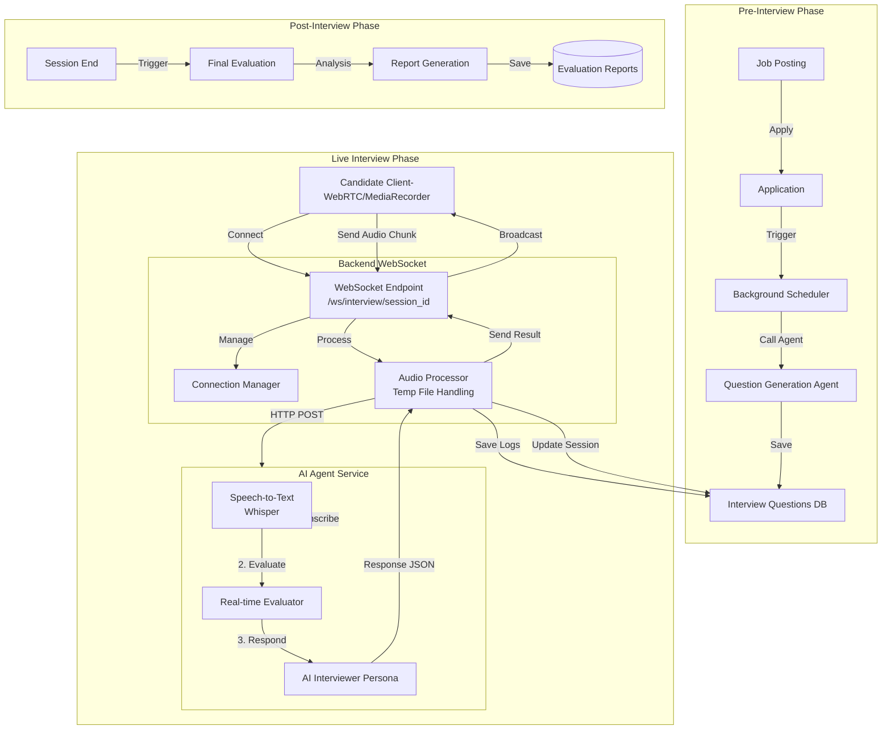

# Interview Part Architecture Workflow

이 문서는 면접 모듈(화상 면접, 실시간 AI 평가)의 아키텍처 워크플로우를 설명합니다.

```mermaid
graph TD
    subgraph PreInterview [Pre-Interview Phase]
        JobPost[Job Posting] -->|Apply| Application[Application]
        Application -->|Trigger| Scheduler[Background Scheduler]
        Scheduler -->|Call Agent| QGen[Question Generation Agent]
        QGen -->|Save| QDB[Interview Questions DB]
    end

    subgraph InterviewSession [Live Interview Phase]
        Candidate[Candidate Client-WebRTC/MediaRecorder]
        
        subgraph BackendSocket [Backend WebSocket]
            WSHandler[WebSocket Endpoint\n/ws/interview/session_id]
            ConnMgr[Connection Manager]
            AudioProc[Audio Processor\nTemp File Handling]
        end
        
        subgraph AIService [AI Agent Service]
            STT[Speech-to-Text\nWhisper]
            Evaluator[Real-time Evaluator]
            Interviewer[AI Interviewer Persona]
        end
    end

    subgraph PostInterview [Post-Interview Phase]
        SessionEnd[Session End] -->|Trigger| FinalEval[Final Evaluation]
        FinalEval -->|Analysis| ReportGen[Report Generation]
        ReportGen -->|Save| ReportDB[(Evaluation Reports)]
    end

    %% Flow Connections
    Candidate -->|Connect| WSHandler
    WSHandler -->|Manage| ConnMgr
    
    %% Real-time Loop
    Candidate -->|Send Audio Chunk| WSHandler
    WSHandler -->|Process| AudioProc
    AudioProc -->|HTTP POST| AIService
    
    AIService -->|1. Transcribe| STT
    STT -->|2. Evaluate| Evaluator
    Evaluator -->|3. Respond| Interviewer
    
    Interviewer -->|Response JSON| AudioProc
    AudioProc -->|Send Result| WSHandler
    WSHandler -->|Broadcast| Candidate
    
    %% Data Persistence
    AudioProc -->|Save Logs| QDB
    AudioProc -->|Update Session| QDB
```
