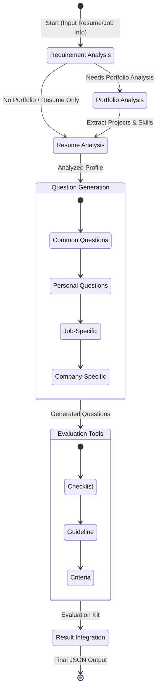
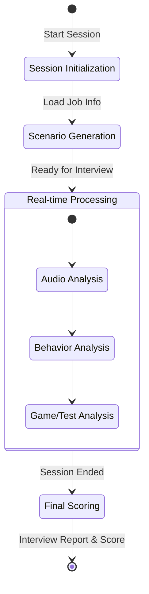
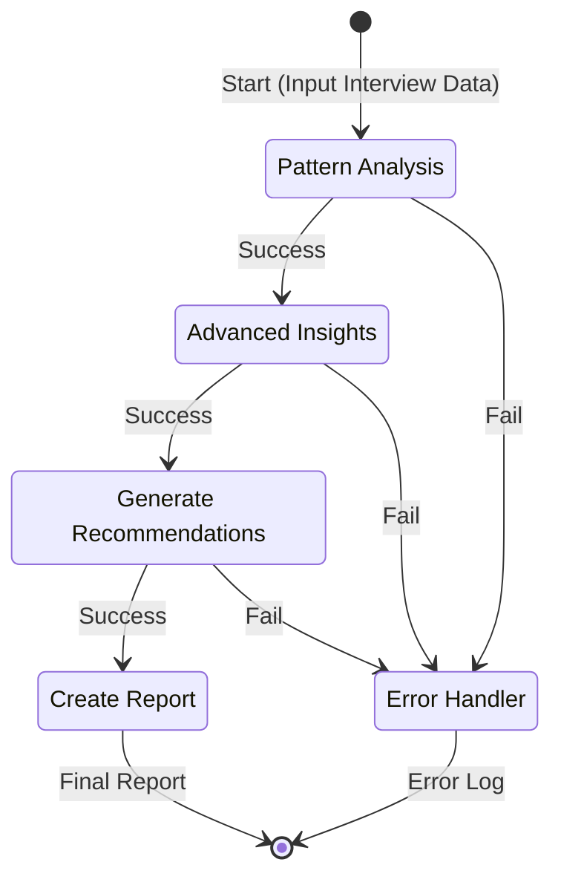
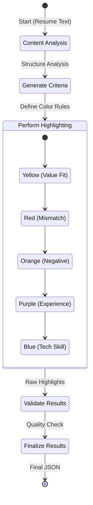

# LangGraph Agent Workflows

이 문서는 `agent/agents` 디렉토리 내의 실제 코드를 기반으로 LangGraph 워크플로우를 시각화했습니다.

## 1. Interview Question Generation Workflow
**참조 파일:** `agent/agents/interview_question_workflow.py`
면접 질문 생성 에이전트의 상태 전이도입니다. 지원자의 포트폴리오 유무, 면접 유형에 따라 흐름이 분기됩니다.

## 2. AI Interview Real-time Workflow
**참조 파일:** `agent/agents/ai_interview_workflow.py`
AI 면접 진행 시 실시간 데이터 처리 및 평가 파이프라인입니다.

## 3. AI Insights Analysis Workflow
**참조 파일:** `agent/agents/ai_insights_workflow.py`
채용 데이터로부터 심층적인 인사이트를 도출하는 분석 파이프라인입니다.

## 4. Resume Highlight Workflow
**참조 파일:** `agent/agents/highlight_workflow.py`
이력서의 핵심 내용을 색상별로 하이라이팅하는 워크플로우입니다.

