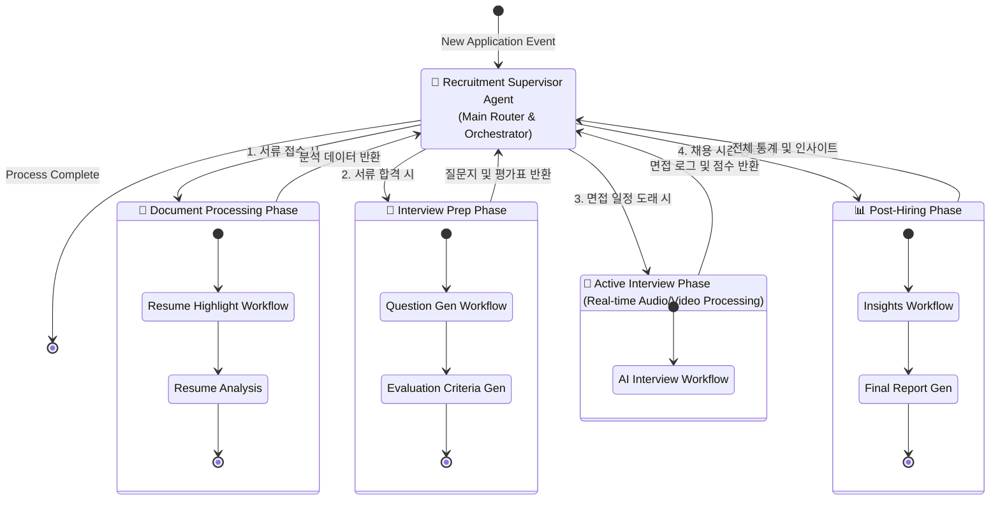

# Unified AI Agent Orchestration Workflow

현재 시스템의 Agent들은 모듈화되어 독립적으로 실행되지만, 논리적으로는 하나의 채용 프로세스 흐름을 따릅니다.
이 다이어그램은 모든 Sub-Graph(하위 워크플로우)를 **'Recruitment Supervisor (채용 감독관)'**라는 상위 Agent가 제어한다고 가정했을 때의 **통합 연결 그래프(SuperGraph)**입니다.

## 워크플로우 연결 설명

1.  **Supervisor (Router Node)**
    *   FastAPI 백엔드 또는 상위 LangGraph 노드가 이 역할을 수행합니다.
    *   지원자의 현재 상태(서류 접수, 면접 대기, 면접 완료 등)를 판단하여 적절한 하위 그래프(Sub-graph)를 호출합니다.

2.  **Phase 1: Document Processing**
    *   **Input:** 이력서 텍스트
    *   **Workflow:** `highlight_workflow.py` 실행 -> 이력서 핵심 하이라이팅 및 결격 사유 필터링.

3.  **Phase 2: Interview Prep**
    *   **Input:** Phase 1의 분석 결과 + 채용 공고
    *   **Workflow:** `interview_question_workflow.py` 실행 -> 맞춤형 질문 및 체크리스트 생성.

4.  **Phase 3: Active Interview**
    *   **Input:** Phase 2의 질문지 + 실시간 오디오 스트림
    *   **Workflow:** `ai_interview_workflow.py` 실행 -> 실시간 상호작용 및 채점.

5.  **Phase 4: Post-Hiring**
    *   **Input:** Phase 3의 누적 데이터
    *   **Workflow:** `ai_insights_workflow.py` 실행 -> 채용 프로세스 개선점 및 통계 도출.

