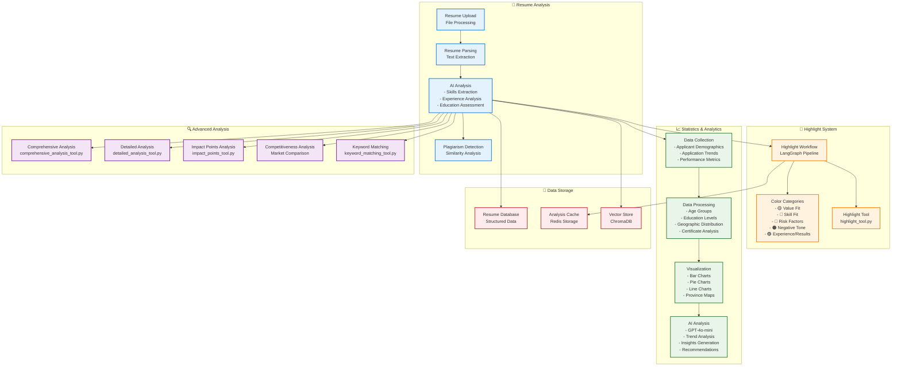

---
config:
  theme: base
  themeVariables:
    background: '#ffffff'
  flowchart:
    curve: linear
  layout: fixed
---
# 시스템 아키텍처 다이어그램

## 시스템 구성 요소 설명

### 📄 Resume Analysis (이력서 분석)
- **Resume Upload**: 파일 업로드 및 처리
- **Resume Parsing**: 텍스트 추출 및 구조화
- **AI Analysis**: 스킬 추출, 경험 분석, 교육 평가
- **Plagiarism Detection**: 표절 검사 및 유사도 분석

### 🎨 Highlight System (하이라이트 시스템)
- **Highlight Workflow**: LangGraph 기반 하이라이트 파이프라인
- **Color Categories**: 5가지 색상 카테고리로 분류
  - 🟡 Value Fit: 인재상 가치
  - 🔵 Skill Fit: 기술 사용 경험
  - 🔴 Risk Factors: 직무 불일치
  - 🟠 Negative Tone: 부정 태도
  - 🟣 Experience/Results: 경험·성과·이력·경력
- **Highlight Tool**: 핵심 하이라이트 도구

### 📈 Statistics & Analytics (통계 및 분석)
- **Data Collection**: 지원자 인구통계, 지원 트렌드, 성과 지표 수집
- **Data Processing**: 연령대, 교육 수준, 지역 분포, 자격증 분석
- **Visualization**: 막대 차트, 파이 차트, 선 차트, 지역별 지도
- **AI Analysis**: GPT-4o-mini 기반 트렌드 분석 및 인사이트 생성

### 🔍 Advanced Analysis (고급 분석)
- **Comprehensive Analysis**: 종합적인 이력서 분석
- **Detailed Analysis**: 상세한 경험 및 역량 분석
- **Impact Points**: 핵심 임팩트 포인트 분석
- **Competitiveness Analysis**: 시장 경쟁력 비교 분석
- **Keyword Matching**: 키워드 매칭 및 스킬 갭 분석

### 💾 Data Storage (데이터 저장소)
- **Resume Database**: 구조화된 이력서 데이터
- **Analysis Cache**: Redis 기반 분석 결과 캐시
- **Vector Store**: ChromaDB 기반 벡터 저장소 