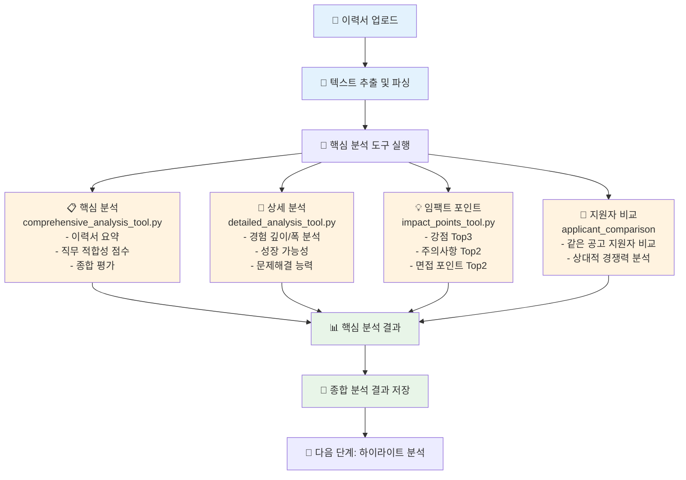
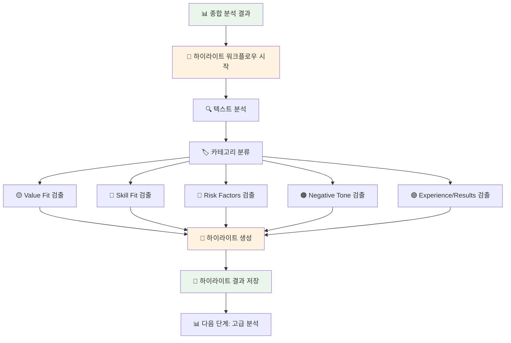
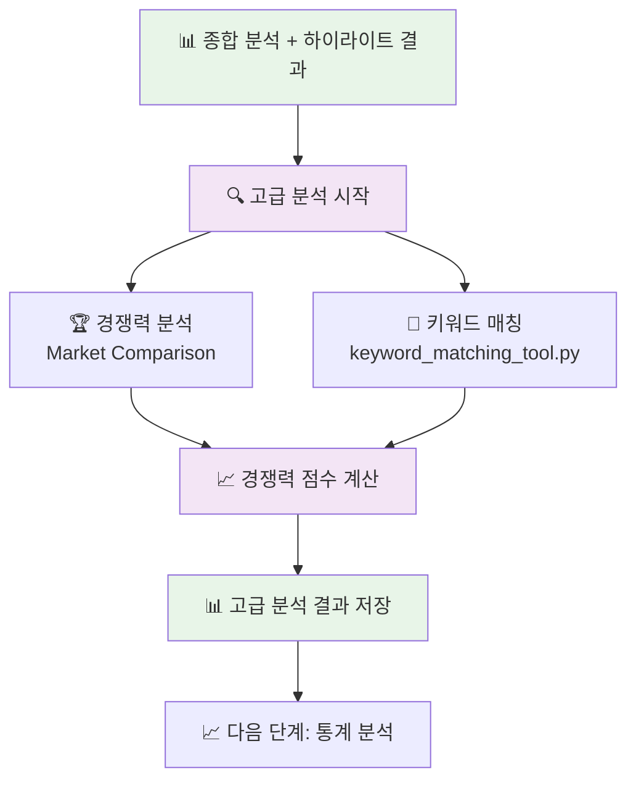
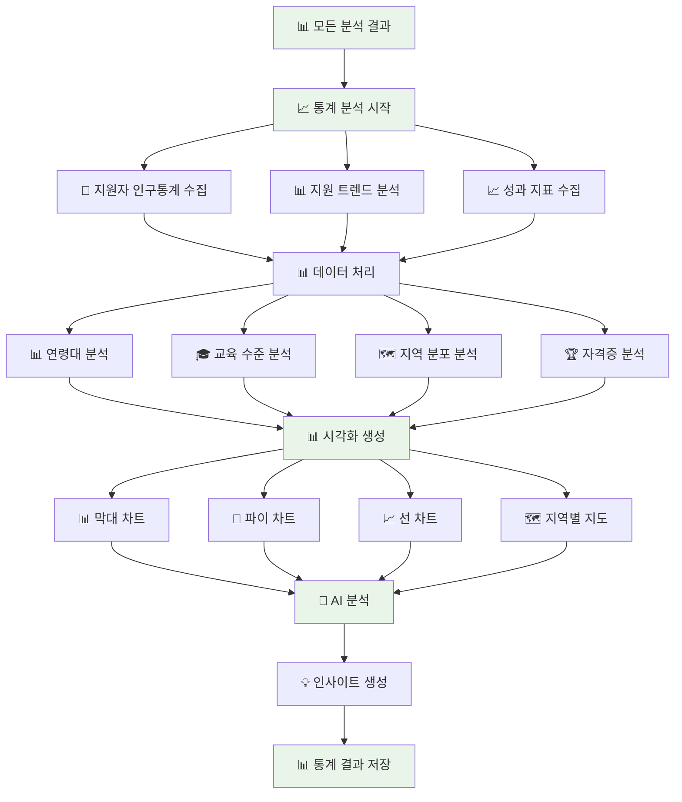
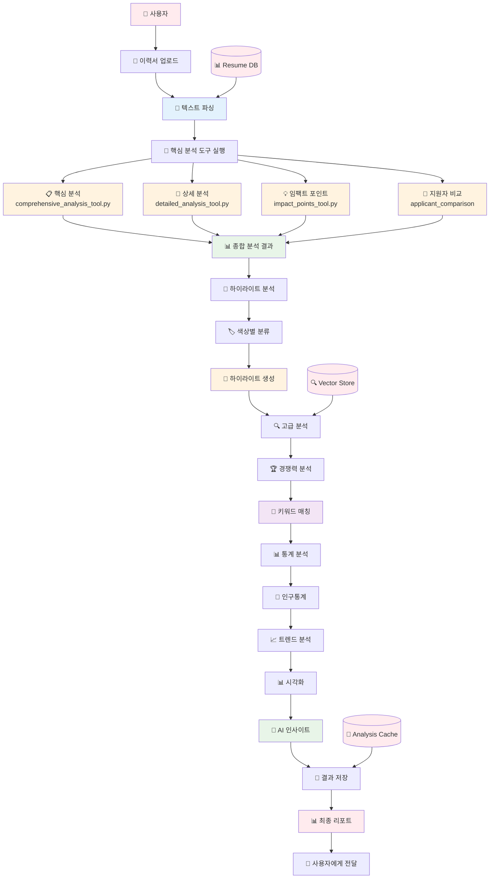
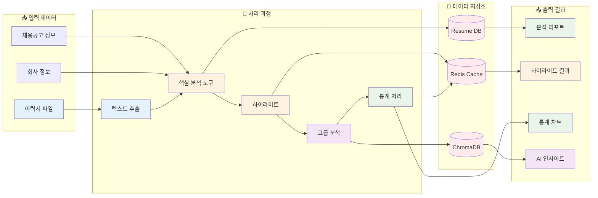

# 업무 흐름도 다이어그램

## 1. 이력서 분석 업무 흐름도

## 2. 하이라이트 시스템 업무 흐름도

## 3. 고급 분석 업무 흐름도

## 4. 통계 분석 업무 흐름도

## 5. 전체 시스템 통합 업무 흐름도

## 6. 데이터 흐름 상세 다이어그램

## 업무 흐름 설명

### 1. 이력서 분석 단계
- **입력**: 이력서 파일 업로드
- **처리**: 텍스트 추출 → **4개 핵심 분석 도구 실행**
  - **핵심 분석**: 이력서 요약, 직무 적합성 점수, 종합 평가
  - **상세 분석**: 경험 깊이/폭 분석, 성장 가능성, 문제해결 능력
  - **임팩트 포인트**: 강점 Top3, 주의사항 Top2, 면접 포인트 Top2
  - **지원자 비교**: 같은 공고 지원자 비교, 상대적 경쟁력 분석
- **출력**: 종합 분석 결과

### 2. 하이라이트 분석 단계
- **입력**: 종합 분석 결과
- **처리**: 텍스트 분석 → 카테고리 분류 → 하이라이트 생성
- **출력**: 색상별 하이라이트 결과

### 3. 고급 분석 단계
- **입력**: 종합 분석 + 하이라이트 결과
- **처리**: 경쟁력 분석 → 키워드 매칭
- **출력**: 고급 분석 결과

### 4. 통계 분석 단계
- **입력**: 모든 분석 결과
- **처리**: 데이터 수집 → 처리 → 시각화 → AI 인사이트
- **출력**: 통계 차트 및 인사이트

### 5. 데이터 저장 및 관리
- **Resume DB**: 구조화된 이력서 데이터
- **Redis Cache**: 분석 결과 캐시
- **ChromaDB**: 벡터 저장소 (고급 분석용)

이 흐름도를 통해 각 단계별로 어떤 데이터가 입력되고, 어떤 처리가 이루어지며, 어떤 결과가 출력되는지 명확하게 파악할 수 있습니다. 